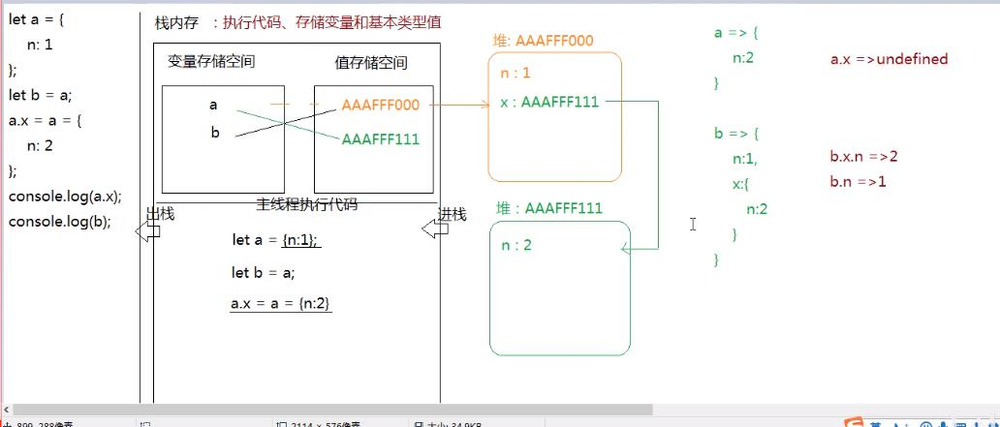

## JS的堆栈运行机制

### 浏览器是如何运行JS代码的？
1.当浏览器的内核（引擎）渲染和解析js的时候，首先会提供一个供js代码运行的环境，我们**把这个环境称之为全局作用域（global scope）**
全局：在客户端叫做window 在后台环境叫做global

2.js代码在解析执行之前会先进行预编译，这个过程会发生变量提升。

3.浏览器分配一个主线程（不是进程），用来从上而下执行js代码，解析一行执行一行，因为js是解释性编程语言

### 栈内存和堆内存
>>JS中的代码运行的环境——全局作用域，也称之为栈内存

1.代码都在栈内存中进行执行，栈内存为js代码的执行提供了运行环境
2.所有的基本类型的值都存储在栈内存的值存储空间中（如果是引用类型的值，那么栈内存的值存储空间中存的是堆内存中引用地址）
3.所有声明的变量都是存储在栈内存中的变量存储空间中

>>JS中独立于栈内存的内存空间————堆内存
引用类型的值由于比较复杂，不能直接存储在当前作用域下。引用类型的值是存储在**堆内存**中的，类似一个仓库，而仓库的钥匙就是堆内存中的引用地址。

对象在堆内存中存储的是键值对
函数在堆内存中存储的是代码字符串


### var a = 12;的细分过程（声明变量并存储--创建值并进行存储--变量与值产生关联）
1.创建变量a，并将创建的变量存储在栈内存中的变量存储空间内
2.创建值12，并将创建的12存储在栈内存中的值存储空间内
3.让变量a和值12产生关联，其实赋值就是让变量和值互相关联的过程。


### 基本数据类型值（值类型）是按照值来操作的
按值操作：意思就是基本数据类型的值在赋值的时候，会把原有的值复制一份，放到新的内存空间，和原来的值没有任何关系。

var a = 12; (细分过程已经说过了)
var b = a ; （细分过程如下）
var b = a的过程中也分为以下几步

首先在当前作用域下创建一个新变量b，并存储至一个新的变量存储空间内
将a变量存储的值12复制一份，将复制的值12放到新的值存储空间内
让变量b和复制的值12产生关联，和存储变量a的内存空间没有任何关系


### var a = {demo：666}；的细分过程
1.创建变量a存储在栈内存中的变量存储空间内
2.在堆内存中开辟一个新的内存空间，把对象的键值对依次存储起来
3.为了保证后面可以找到这个空间，**此空间有一个16进制的引用地址**
4.将此引用地址存储在栈内存中的值存储空间中
5.让变量a和值存储空间中的引用地址产生关联

### 引用数据类型值（址类型）是按照引用地址来操作的
按址操作：意思就是引用数据类型的值在操作的时候，会将原有的引用类型值的内存空间的引用地址进行复制，所以会出现多个变量存储同一个引用地址，从而指向同一个内存空间，变量对于引用数据的值的操作会影响其他变量的值。

### 面试题一（考察js中变量声明和赋值的先后关系）
```
var obj = {
		a:10,
		b:obj.a * 10
	};
	console.log(obj.b);
```
以上代码执行的结果是：Uncaught TypeError: Cannot read property 'a' of undefined（类型错误）

**重点看变量声明和变量赋值的过程先后顺序理解的是否正确**

第一步：在当前作用域下创建一个变量obj，并存储在栈内存中的变量存储空间中
第二步：由于是引用类型值，会在堆内存中开辟一个内存空间，将对象中的键值对依次存储
第三步：按道理是存储结束之后生成一个16进制的内存地址，然后将这个内存地址放在栈内存中的值存储空间中，然后让变量和该引用地址产生关联，这是理想的情况。

注意：但是这里在堆内存中存值的时候，属性b的值obj.a*10中的obj其实是undefiend，因为只有值存储完成之后才生成引用地址，然后才让变量obj和改引用地址产生关联，这里存储过程都还没有结束，还没有产生关联，所以这里的obj是undefined，就等于在执行undefined.a *10,所以这里的代码在执行的时候会报错，报错信息为：Uncaught TypeError: Cannot read property 'a' of undefined

`核心是搞懂在JS中变量的声明赋值的先后关系，一定是先创建变量----然后将值存储到内存空间---让值和变量产生关联，如果在存储的过程中就引用变量，那么肯定会报错`


### JS中变量在定义时的连续赋值
var a = b = 10;
在运算符优先级一样的情况下，实际从右向左分为三部走：
b = 10; b未声明就赋值 会成为全局变量 也就是window.b = 10
var a;  a声明后未赋值，默认值为undefined
a = b;  将变量b保存的值10复制一份，赋值给a变量，此时a变量值变为10

在运算符优先级不一致的情况下，会产生不同的赋值顺序：
var a = {}；
a.x = a = {n:2};

由于字段访问.符号的优先级远远大于赋值运算符号=的优先级，所以如下：
先执行a.x = {n:2}; 在a变量所关联的对象上添加一个x属性，属性值为{n；2}
此时a对象为：a = {
	x:{n：2},
}
再执行a = {n:2};将a变量重新指向一个新的堆内存空间，该空间中存储的是{n；2}
此时a对象为：a = {n:2};

### 阿里面试题二 （考察变量的连续赋值以及堆栈内存存储数据的关系）
```
let a = {
	n:1
};

let b = a;

a.x = a = {
	n:2
};

console.log(a.x);  undefined
console.log(b); {n:1,x:{n:2}}
```

详解面试题：
1.浏览器先在内存空间中分配出一块栈内存空间用于JS代码的允许环境
2.栈内存用于存储变量和基本数据类型的值，也就是值存储区域和变量存储区域
3.浏览器分配一个主线程用于执行JS代码，进栈执行，执行完出栈
4.变量a存储在栈内存的变量存储区域中，由于存储的引用类型的值，将{n：1}在堆内存中开辟一个空间，将键值对存储进去，并将该堆内存空间的16进制地址存储在栈内存的值存储区域，然后将变量a和引用地址值进行关联。
5.将变量b存储在栈内存的变量存储区域中，并将a变量在堆内存的引用地址和变量a产生关联。
6.在js的运算中“.”和"="运算符同时出现，会先执行"."运算
a.x = {n:2};  给a添加x属性，值为{n;2}
a = {n:2};   然后将a指向新的内存空间

var c = {n：1}的关联
先在栈内存中开辟一个变量存储空间，将声明的变量c放进去
然后在堆内存中开辟一个空间将对象的键值对依次存储，并生成一个16进制的内存地址
将生成的内存地址放在栈内存的值存储空间中
让变量存储空间中的变量c与值存储空间中的引用地址产生关联

### 面试题三（堆的嵌套及内存的无限溢出）
```
let a = {n:1};
let b = a;
a.x = b;
console.log(a);  
console.log(b);
```
前两步会导致a变量和b变量都指向同一个堆内存空间，一个变会影响另外一个变化
a.x = b;这一步的意思是在a变量上添加一个x属性，属性值为b，b和a指向同一内存地址，那么就等于添加自身a，会导致堆的嵌套，造成内存的无限溢出，所以这样做是错误的。

### 面试题四 综合考察
```
let n = [10,20];
let m =n;  //指向同一空间 m 和 n
let x = m; // m n x 指向同一空间
m[0] = 100; // [100,20] 三个变
x = [30,40]; // x = 【30,40】；mn还是[100,20]
x[0] = 200; // x = [200,40] mn还是 [100,20]
m =x; // x m n 又都指向[100,20]
m[1] = 300; // [100,300]
n[2] = 400;
console.log(m,x,n) 

```


### script标签放到头部和放到尾部的区别，以及解决方法？