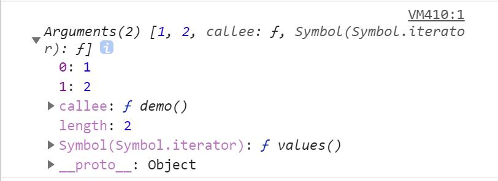

### JS中的函数是什么？
在JS中，函数就是一个方法或者说一个功能体。基于函数一般都是为了实现某个功能。
函数诞生的目的就是为了封装，将实现某个功能的代码封装到一个函数中，后续实现这个功能只需要将函数执行一遍即可，不需要写冗余的重复代码，实现低耦合高内聚。减少页面的冗余代码，提高代码的重复使用率。
### 函数的三种创建方法（实名函数 匿名函数 箭头函数）
>>> 普通函数的创建和执行
 函数创建 ：function 函数名([形参变量1],...){
	 函数体...：基于JS完成需要实现的功能
	 return [函数处理之后的结果]
 }
 函数执行：函数名([实参变量1]，...)

>>> 匿名函数之函数表达式：把一个匿名函数本身作为值赋值给其他东西，这种函数一般不是手动触发执行，而是靠其他程序驱动触发执行，例如事件绑定的回调函数，以及定时器的回调函数。
```
div.onclick = function (){}; 点击事件触发之后执行该匿名函数
setTimeout(function(){},1000); 定时器延时1s之后执行该匿名函数
```
>>> 匿名函数之立即执行函数:创建一个函数之后自身马上执行
```
(function(n){
	n =>100;
})(100);
```

 
 let 函数名 = ([参数参数])=>{
	 函数体...
 }
 
### 函数的创建和执行的底层机制

函数作为JS中引用数据类型的一种，它也是按照引用地址来操作的。
【创建函数】

1.先在堆内存中开辟一个空间，生成一个16进制的引用地址
2.将函数体中的代码当做**字符串**存储在开辟的空间中（普通对象存储的是键值对）
3.在栈内存中开辟一个变量存储空间，函数名存储进去
4.在栈内存中开辟一个值存储空间，将引用地址存储进去
5.将函数名和引用地址关联起来

【函数执行 创建环境---复制代码字符串变为js代码---自上而下执行js代码】
函数的创建其实是没有实际意义的，只有一个函数被执行才有实际的意义

1.函数执行首先会在栈内存中创建一个供js代码执行的私有环境，也就是函数作用域
2.将之前在堆内存中存储的代码字符串复制一份过来，变为真正的JS代码
3.在新开辟的函数作用域中自上而下进行执行，实现其应有的功能

一个函数被执行多少次，那么栈内存中就会开辟多少个相互独立的私有函数作用域，在函数执行结束之后，通过JS引擎的垃圾回收机制将这部分栈内存空间进行回收。


### 函数的参数：形参 实参 arguments ...arg

函数的**形参本质是变量**，等于在该函数的作用域内声明了两个变量。
函数在执行的时候传递的值是实参，实参是**具体的数据值**。

传递进去的实参个数小于形参，那么未接受到实参值的形参的值为undefined
传递进去的实参个数等于形参，那么是一一对应的关系
传递进去的实参个数大于形参，那么多余的形参不会被接收

### 给函数的形参赋初始值的方法
为了避免函数的形参没有接受到对应的实参的时候值为undefined的尴尬，因为当形参的值为undefined的时候，后续进行数学运算的时候很容易导致计算的结果为NaN。

>>> ES5以前方法：
```
function add(n1,n2){
	
	<!-- 最严谨方法 利用typeof操作符 -->
	if(typeof n1 == 'undefined') n1=0;
	if(typeof n2 == 'undefined') n2=0;
	
	<!-- 第一种 利用或逻辑运算符的短路原则 -->
	如果传递的参数本身就是null 空串 false本身布尔值就为false的情况，那么这种写法也是有误差的。因为就算传了参数为null，那么也会被赋值为0.
	n1 = n1 || 0;
	n2 = n2 || 0;
	
	<!-- 第二种 利用相等运算符 -->
	if(n == undefined) n=0;
	因为在js中除了undefined等于自身，null == undefined也是成立的，所以如果要使用相等运算符的思想来做的话，需要将==修改为===全等运算符。
	
	... 具体要执行的业务代码
	return XXX;
}
```
>>> ES6新增的方法：可以直接在定义形参的时候声明其初始值
```
function add(n1=0,n2=0){
	... 具体要执行的业务代码
	return XXX;
}
```

### 获取某个函数的形参个数和实参个数
add函数的形参个数：add.length 函数名.length
add函数在调用时的实参个数：argements.length
```
function add(n1,n2){
	console.log(arguments.length)
	return n1+n2;
}
add(10);


```


### 函数的返回值return
1.函数return关键词的注意点

+ 函数return的一定是值，如果return的是一个变量，那么代表return的是这个变量中所存储的值
+ 函数执行所代表的就是函数return的那个值，但是需要在函数执行的时候用一个变量去接收一个值
+ 如果函数没有显式的写return语句，那么一个函数执行的结果如果用变量接受，默认值为undefined
+ 函数体中遇到return，后续代码就不再执行了

2.return关键词的应用场景

在函数外部想要获取函数执行的结果，通过return函数执行的结果在外部接收
在函数外部想要拿到函数执行作用域中的某些值或者变量，通过return一个函数形成闭包
如果满足某个条件就中止函数执行，通过return来执行

### 函数内置的实参集合 arguments对象
arguments对象是所有函数都存在的局部变量，但是箭头函数没有arguments对象
Arguments实参集合对象，首先它是每一个函数创建就内置的对象，实参和行参是否传递，arguments都是始终存在的。

arguments实参集合对象是一个类数组，因为这个对象中有数字作为属性值，并且还有length属性


arguments实参集合对象中存储着所有函数执行时的实参信息列表，注意是在执行的时候，也就是说arguments只在函数体内使用


arguments.callee  指向当前函数本身  但是在严格模式下使用的时候会报错，现在一般都不用
arguments.length  用于获取实参列表
arguments[index]  获取实参列表中的第index个实参的值

>>> 案例：封装一个函数，实现其任意数求和
1.每次传递的实参个数是变化的
2.每次传递的实参数据类型不定
3.要求实现不管传递什么值，要实现其中有效数字求和。
当一个函数创建的时候，其内置的arguments对象就被创建了。
```
function add(){
	var count = 0;
	for(var i =0 ; i<arguments.length;i++){
		var value = Number(arguments[i]);
		if(isNaN(value)){
			continue;
		}
		count += value;
	}
	return count;
};
```
>>> 案例：通过arguments.callee实现递归函数


### ES6中的箭头函数
>>> 箭头函数书写简单
let fn = (n,m)=>{return n+m };

特殊书写规则：
+ 只有一个形参的时候，小括号可以省略
let fn = n => {return n*2};

+ 函数体中的语句只有一条return 语句的时候，那么retrun和大括号都可以省略
let  fn = n => n*2;

>>> 箭头函数形参赋值默认值
let fn = (m=0,n=0)=> m+n;

>>> 箭头函数中没有arguments实参集合对象，但是提供了剩余运算符...arg来获取传递的实参集合
let fn = (...arg){
	console.log(arg);
}
arg在这里是arguments的缩写，就是一个变量，其实也可以命名为a，b等其他标识符都可以
...运算符在ES6中被称作剩余运算符
箭头函数中的实参列表集合用arg来获取，注意arg获取到的是真正的数组，而arguments获取到的是类数组。所以arg就可以使用数组原生的方法来操作。

eval()方法可以将一串JS代码字符串来执行并返回结果
var x = eval('10+20+60');
console.log(x);

var y = Function('"use strict";return 10+20+30')();
console.log(y);
			

### 为什么说函数在JS中是一等公民？
