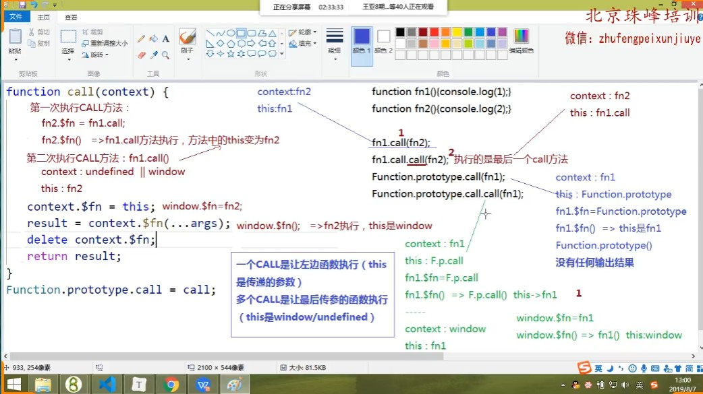

## 为什么每一个函数都可以通过点方法直接调用call apply和bind方法？
JS中的每一个函数（普通函数 构造函数 内置类）都是内置类Function这个类的实例，所以每一个函数的__proto__属性都指向类的原型Function.prototype。

特殊的一点是：我们都直到所有类的原型都是一个对象，但是Function.prototype却是一个空的匿名函数（anonymous 额闹你mes 匿名的，无名的），但是为了理解我们可以把它当作一个对象来使用即可。

Function.prototype上部署了所有函数都可以调用的公共方法，需要我们学习的几个方法是call、apply以及bind,任何函数都可以直接fn.call()去调用这几个方法。这三个方法都是用来修改函数运行时的this指向的。

## 实例.内置方法()的底层逻辑 比如arr.push() 或者fn.call()
>> 实例.内置方法执行分为三步来理解：
1.首先实例基于原型链__proto__找到当前实例内置类的原型上的方法
2.将这个内置类的原型上的方法执行
3.这个方法在执行的时候，会对当前这个实例产生改变，而这个改变的过程正好就是这些内置方法的作用，如果不能改变那就没必要调用了。

>> 一般情况下，内置方法中的this都指向当前操作的实例本身

比如arr.push(1)分三步来看待：
1.找到Array.prototype上的push方法
2.将push方法执行
3.执行的时候会将1这一项添加到实例arr数组的末尾，此时arr发生改变

比如fn.call(obj,5)分三步来看待：
1.找到Function.prototype上的call方法
2.将call方法执行
3.执行的时候会将实例fn中的this从fn修改为指向obj，此时实例fn中的this发生了改变

## call方法基础语法
>> 语法：fn.call([context],[params1],[params1],...)

>> 功能：
fn基于原型链找到Function.prototype上的call方法并且将call方法执行，call方法执行的时候会做两件影响实例的事情：

a.将fn这个函数自上而下进行执行
b.执行的时候会将实例fn中的this从fn修改为第一个传递给call的实参，把传递给call函数其余的实参当做fn函数的参数传入

>> 注意：fn.call()执行时传递的第一个参数

如果一个函数fn在调用call方法的时候传递的参数是(不传 undefined null),那么在非严格模式下fn中的this指向window;在严格模式下this指向undefined。

call方法第一个参数除了undefiend和null之外，其余的所有数据类型都可以传，传什么就是什么。当传入的是基本数据类型的值时，会将在这个基本值包装为基本包装类,也就是对象数据类型，如果是引用值，直接使用传入的值即可。

fn.call(obj);    		此时this为obj
fn();            		此时this为window,严格模式下为undefined
fn.call();       		此时this为window。严格模式下为undefined
fn.call(null);  		此时this为window。严格模式下为null
fn.call(undefiend);     此时this为window。严格模式下为undefiend

>> 注意：fn.call()执行时传递的其他参数
function fn(n,m){}

fn.call()      this指向window，n和m都是undefiend
fn.call(10,20) this指向10，n是20，m是undefined
注意此时虽然传入的参数是基本值10，但是是经过包装之后的引用值Number {10}
  
## 基于原生js写一个call方法
>>> 重写call方法的原理：
function sum(n,m){
	console.log(this);
	console.log(n+m);
}
var obj = {
	name:'666'
}
要想sum()执行时this指向obj对象，根据this的一个基本定律：如果有一个对象obj，obj有一个属性sum，属性值为该函数，那么obj.sum()执行，sum函数中的this必然是指向obj的。
obj.x = sum;
obj.x();
delete obj.x;


>>> 所以重写call方法，需要注意的有以下几点：
1.注意传递的第一个参数context为空或者其他基本数据类型值的情况
2.如何获取函数arguments中除了第一个参数之外的其他参数，也就是如何先将类数组转化为数组调用数组api处理参数，然后再将参数数组转化成为序列。
3.方法的返回值一定是函数执行的结果，该方法的this指向方法的调用者
4.记得使用闭包和立即执行函数，将自己封装的方法保护起来
5.最后将自己封装的方法拓展到原型链上

>>> 几个亮点
对参数context默认值的约束验证
for循环从i=1开始循环，直接拿到实参列表中第一项后的值并放到一个数组中
虽然将一个类数组转化为数组还有Array.from()和Array.prototype.slice.call()方法可以使用，但是for循环的兼容性是最好的，并且省去了后续slice截取的步骤。

```
~function(){
	/*
		@params:context 函数运行时改变的this指向
		参数可以不传递，不传递默认指向window
		如果传递必须是引用类型值，因为基本类型值不可以通过点方法添加自定义属性
		@return:result  函数执行的结果
	*/
   function myCall(context){
	   context = context || window;
	   let arr = [],
		   result;
	   for(var i=1;i< arguments.length;i++){
		   arr.push(arguments[i]);
	   }
	   context.$fn = this;
	   result = context.$fn(...arr);
	   delete context.$fn;
	   return result; 
   }
   Function.prototype.myCall = myCall;
}();


```

## fn.call()执行和fn.call.call()执行有什么区别？
前提：Function.prototype上部署的公共方法call，假设该方法表示为function $1(){};

fn.call()执行，代表将Function.prototype上的call方法也就是$1方法执行了，此时call方法执行时的this是fn，方法执行前有点，那么this就是点前面的fn。

fn.call.call()执行，由于fn.call就代表Function.prototype.call方法，它自身也是一个函数，函数就是Function类的实例，所以fn.call.call基于原型链查找方法最终还是代表执行了Function.prototype上部署的公共方法call，也就是$1方法被执行，但是此时的this是fn.call，也就是$1。

总结：
两次执行都是执行的同一个方法，都是Function.prototype上部署的公共方法call
但是不同的地方在于每一次执行时的this不同。

## 阿里较难call面试题（深入理解call和多个call连续执行的区别）

```javascript
function fn1(){
	console.log(1);
}
function fn2(){
	console.log(2);
}

fn1.call(fn2);    1
fn1.call.call(fn2);  2
Function.prototype.call(fn1);  什么都不打印
Function.prototype.call.call(fn1); 1

总结规律：
一个call是让左边的函数自身执行，将左边函数中this修改为括号中传入的参数
多个call是让最后传参的函数执行，最后执行的时候this是指向window的。
```
基于上面手动封装的源码一步步解析：



+ fn1.call(fn2)的三个步骤：
1.找到Function.prototype上的call方法并执行call方法
2.执行call方法会产生两个影响：
	a:将fn1函数执行一遍 此时打印1
	b:将fn1函数中的this指向fn2
	
+ fn1.call.call(fn2)的步骤：
当多个call连续调用的时候，永远是先执行最后一个call
基于源码来分析
fn1.call.call(fn2)
1.第一次将fn1.call整体当做call方法调用者来看待
{
	context:fn2
	this:fn1.call
}
fn2.$fn = fn1.call;
fn2.$fn(); fn1.call方法执行，将fn1.call这个方法本身指向的堆内存中的函数体中的this修改为fn2，这一步是关键，等于fn1.call这个方法的this已经被修改为fn2了，原本默认可能是window，但是现在已经被修改了。

2.第二次将fn1.call方法执行
{
	context：undefined||window，
	this：上一步中固定好的fn2
}
window.$fn = fn2;
window.$fn ()==>就等于将fn2执行，此时会打印2

+ Function.prototype.call(fn1);
{
	context：fn1，
	this：Function.prototype
}
fn1.$fn = Function.prototype;
fn1.$fn ()==>就等于将Function.prototype执行，而Function.prototype本身是一个匿名的函数，执行结果为什么都不打印。

+ Function.prototype.call.call(fn1);
分析方法同上，最终执行的是fn1方法。第一次执行先把Function.prototype.call这个方法中的this修改为fn1；第二次再执行的时候由于没有传入参数，等于在window上执行了fn1这个方法，最终打印1。


## apply方法及其重写
## apply方法基础语法
和call方法一样，都是把函数执行并且改变函数执行时的this指向的，唯一不同的地方在于传递给函数的方式不同。
fn.call(obj,n1,n2,n3...) 参数用逗号隔开一个个传递
fn.apply(obj,[n1,n2,n3...]) 所有参数封装到一个数组中然后一次性传递

## 手写apply方法
基于之前写的call方法可以轻松的写出apply方法
```
~function(){
	function myApply(context){
		context = context || window;
		let arr =[],
			result,
			len = arguments.length;
		
		if(len ==0 ||len == 1){
			arr = [];
		}else{
			arr = Array.from(arguments)[1];
		}
		console.log(arr);
		
		context.$fn = this;
		result = context.$fn(...arr);
		delete context.$fn;
		return result;
	}
	Function.prototype.myApply = myApply;
}();

```
## 获取数组中的最大值和最小值(apply用法)

1.使用apply方法第二个参数是数组的特性
数组并没有arr.max方法，但是Math数学对象上有max方法
```
var arr = [1,456,12,23,45,12,-4,-84];
var max = Math.max.apply(null,arr);
var min = Math.min.apply(null,arr);
```
2.先进行数组升序，然后取第一项和最后一项
```
var arr = [1,21,56,24,1,4,12,45];
arr.sort((a,b)=>{return a-b;})
var min = arr[0];
var max = arr[arr.length - 1];
或者
var max = arr.reverse()[0]
```
3.for循环依次取出值进行比较
基于假设法，假设数组中第一项是最大的或者最小的，然后让数组中的每一项都和当前假设的值进行比较，如果假设成立则继续比较，如果假设失败则将当前项的值重置为新的假设值，然后又开始向后比较。
```
var arr = [1,21,56,24,1,4,12,45];
var max=min= arr[0];
for(var i=0;i<arr.length;i++){
	if(arr[i] > max){
		max = arr[i];
	}else if(arr[i] < min){
		min = arr[i];
	}
}
console.log(max);
console.log(min);
```
4.基于ES6...展开运算符
babel.js中将...编译为ES5的底层原理其实就是var max = Math.max.apply(Math,arr);
```
var arr = [1,21,56,244,1,4,12,45];
var max = Math.max(...arr);
var min = Math.min(...arr);
console.log(min);
console.log(max);
```


## bind方法基础语法
和call/apply方法一样，也是用来改变函数中的this关键字的，只是单纯的改变函数中的this，但是并不执行函数，起到的作用就是可以在函数执行前预先改变this。
bind还有一个作用就是可以在函数执行之前就预先将实参传递给函数。

```
var obj = {name:"lilei"};
function fn(){
	console.log('点击事件被触发')
}
document.body.onclick = fn; 
给document.body绑定一个点击事件，事件触发时this指向document.body


```
要求在事件触发的时候，将方法fn中的this指向obj，如何实现？
方案一：document.body.onclick = fn.call(obj); 错误
此方案不可以，因为这样做等于将fn执行之后的结果绑给了点击事件，而不是将fn绑定

方案二：匿名函数嵌套法
document.body.onclick = function(){
	fn.call(obj);
}
此方案可以实现，本质是将匿名函数绑定隔了点击事件，事件触发时匿名函数执行，从而fn.call(obj)也被执行，所以fn中this会被修改为obj的时候函数也被执行了。

方案三：document.body.onclick = fn.bind(obj)
此方案可以实现，等于在fn函数执行之前预先的将函数中this修改为obj，此时fn并没有执行；而call和apply改变this的时候方法会立即执行。
bind方法存在兼容性问题，在IE6-8中不支持bind方法
将bind方法这种可以预先去做一件事情的思想叫做柯里化函数。【JS高级程序设计中有一章节】

## bind方法重写及函数柯里化思想(函数柯里化就是闭包的应用)
### 1. 手写JS中bind方法
执行bind方法的结果就是会返回一个匿名函数，当事件触发的时候让匿名函数fn执行，我们再执行匿名函数fn内部的事件回调函数并让其执行即可。
```js
(function(){
	this==>       当前调用myBind方法的函数
	context===>   需要改变的this指向
	outerArgs===> 其余需要传递给函数的实参信息
	
	function myBind(context,..outerArgs){
		context = context || window;
		let that = this;
		return function(...innerArgs){
			that.call(context,...outerArgs.concat(innerArgs))
		}
	}
	Function.prototype.myBind = myBind;
})();

function demo(a,b){
	console.log(this.name)
}
var obj = {
	name:100;
}
window.name = 200;
demo.bind(obj,10,20)

```


### 2.经典柯里化面试题：实现一个ADD函数，需要满足如下功能：
add(1);         1
add(1)(2);      3
add(1)(2)(3);   6
add(1)(2,3);    6
add(1,2)(3);    6
add(1,2,3);     6
add(1)(2)(3)(4) 10


### 3. 函数柯里化思想初发现
函数柯里化思想是一种预先处理的思想，主要是利用闭包的机制。
常见需求：当点击body的时候,触发click点击事件及事件回调函数fn，满足如下需求有几种方法？

function fn(a,b){
	console.log(this.name);
	console.log(a,b);
	console.log(arguments);
}

+ 让事件回调函数fn中的this变为obj
+ 并且传递两个实参100,200
+ 并且还需要拿到当前点击事件的事件对象event

```js
先执行匿名函数，在执行匿名函数的时候执行里面的代码，这也是bind方法背后的原理
document.body.onclick = function(e){
	fn.call(obj,100,200,e);
}
```

```js
bind方法可以默认将当前点击事件的事件对象当做传递的实参列表中的最后一位参数传递进去，所以使用bind的时候不用显式的传递事件对象,事件对象会在最后一位默认传递进去。
document.body.onclick = fn.bind(obj,100,200);
```


### 函数柯里化的代表 bind方法的实现原理及流程

1. 一个函数fn调用了bind方法并传递了若干参数，此时bind方法执行会形成一个私有的函数作用域

2. 将调用bind方法时传递的参数保存在当前函数的作用域中

3. 调用bind方法的目的是在函数执行前修改函数运行时的this指向及参数，也就是说执行bind方法会return一个新的匿名函数，该匿名函数的参数就是上一级作用域中保存的哪些私有变量，此外该匿名函数自己也可以传递一些参数

4. 将该匿名函数retrun出去，此时return出去的函数始终保持着对函数内部某些私有变量的引用，所以此时形成了闭包。所以bind方法执行时的函数作用域无法被销毁，从而起到了闭包可以保存私有变量的功能。


### 什么是预先处理思想及柯里化函数？
+ 预先处理思想：其实就是利用了闭包两大作用中的保存功能，将传递进去的参数先保存在函数的私有作用域中保存起来，当用到的时候去原有的函数作用域中按照作用域链查找机制进行查找，这种预先把一些参数保存在不被销毁的作用域中，等到用的时候去拿的思想其实就是柯里化函数思想。

+ 什么是柯里化函数？
其实就是闭包，在当前函数的作用域中预先保存一些信息，供该函数的子级作用域中的其他小函数使用。手写的bind方法就是最经典的柯里化函数编程思想
function fn(x){
	return function(y){
		return x+y;
	}
}
fn(100)(200) 预先在闭包中将x的值保存起来 返回300