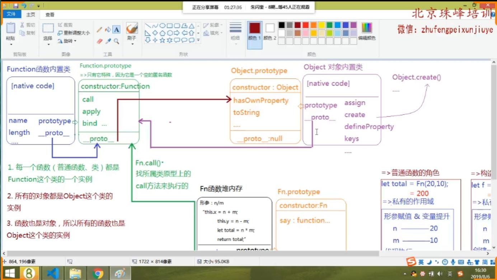

## JS中数据类型为函数的值：
+ 普通函数（函数声明 函数表达式 立即执行函数 箭头函数等）
+ 自定义类
+ JS底层内置类（Array Number Object等）

## JS中数据类型为对象的值：
+ 普通对象{}
+ 数组对象[]
+ 正则对象/\d/
+ Date日期对象
+ Math数学函数对象
+ 函数实参集合arguments类数组对象
+ HTMLCollection/NodeList 元素集合或元素节点集合 类数组对象
+ 由类构造出来的实例也是对象
+ 类的原型prototype对象(函数类Function prototype对象除外，它是一个匿名空函数)
+ 每一个函数也是对象

## Function.prototype 和 Object.prototype的关系？


## 角色一：作为一个普通函数
+ 形参 实参 
+ arguments
+ return
+ 箭头函数
+ 私有作用域
+ 形参赋值 变量提升
+ 作用域链
+ 栈内存释放机制(闭包)
+ 普通函数执行时的this指向

## 角色二：作为一个构造函数，也就是类
+ 类和实例的关系
+ new执行时的this指向以及内部原理
+ 类的prototype原型对象
+ 原型对象
+ instanceof
+ constructor
+ hasOwnProperty

## 角色三：作为普通对象存在
把函数当做一个普通对象存在的时候(键值对)，可以给一个函数添加属性，另外函数自己也有天生就有的属性。
+ name属性 代表当前函数的名字
+ length属性 代表当前函数的形参个数
+ prototype属性  指向当前函数的原型对象

## 函数三种角色之间的联系

+ 函数当做普通函数执行的时候和类没有关系，和类的原型对象上的公有属性和方法也没有关系，主要考虑作用域以及作用域链这一块的内容。

+ 函数当做构造函数new执行的时候，主要和类的原型对象以及构造出来的实例有关，还要注意new执行的时候如果return的是基本值不会影响，如果是引用值会受影响。此时和函数内部的私有变量以及作用域链这部分内容没有关系。

+ 函数当做普通对象存在的时候，它自身的属性以及通过点方法给函数添加的属性，和该函数构造出来的实例对象以及当做普通函数执行时的私有变量这些都没有关系，只和键值对有关系。

## 为什么Function.prototype === Function.__proto__  true


Function函数内置类，类也属于函数类型，是函数就有双重角色，即是函数又是对象。

>> Function函数作为函数来说：
函数必然有内置的属性prototype,特殊的一点是Function.prototype是一个函数体为空的匿名函数。假设堆内存地址为FA001。

拓展：Function.prototype是一个空的匿名函数,但是我们在这里将它看做和Number.prototype等这种类的原型对象一样来看待。就会发现每一个类的原型对象该有的它都有：

+ Function.prototype对象上部署了call、apply和bind三个每一个函数实例都可调用的公共方法，类似于Array.prototype上部署了push，concat，slice等每一个数组实例都可以调用的方法。

+ Function.prototype对象的内置constructor属性指向类本身也就是Function。

+ Function.prototype对象的__proto__属性指向Object.prototype,因为Function.prototype也是对象，一切JS中的对象都是Obejct类的实例，所以它指向Object.prototype.


>> Function函数作为对象来说：
对象自身就有以下几个常见的键值对属性：
name：函数名称
length:函数形参长度
__proto__:指向当前实例的类的原型对象。

第一步首先确定当前实例是什么，当前实例是Function这个JS底层的内置类,类的本质是一个函数，只不过有对象角色而已，千万不要以为有对象的角色就是对象了，它本质还是函数。所以得出结论：当前实例是Function这个类。

第二步：根据JS中每一个函数(包括普通函数和类以及内置类)都是Function这个内置类的实例，也就是说哪怕是Function这个类，它是函数，是函数那就是Function这个内置类构造出来的。所以得出结论：Function这个实例的构造函数还是Function类。

第三步：根据原型链的知识，每一个实例的__proto__属性都指向构造这个实例的类的原型对象。得出结论：Function.__proto__ = Function.prototype

所以：Function.__proto__ === Function.prototype 结果为true

>> Object这个类即是函数也是对象：
Object.__proto__ 指向构造Object类这个实例的类，也就是Function.prototype,而Function.prototype.__proto__又指回Object.prototype。

>> 所有的值都是Object类的实例，万物皆对象
+ Object本身就是Function这个类的一个实例
+ Function又是Object这个类的一个实例
+ Object又是Object类的实例
+ Function又是Function类的实例

jQuery是一个构造函数：jQuery.prototype上有很多供实例操作的方法，比如map.slice等
$()代表创建了一个jQuery这个类的实例,可以调取jQuery.prototype上的方法，比如
$().map();

jQuery是一个对象，在它的堆空间中也存在很多方法，例如ajax方法，比如$.ajax()

## 阿里超难面试题
>>> 题目
```
function Foo(){
	getName = function(){
		console.log(1);
	};
	return this;
}

Foo.getName = function(){
	console.log(2);
}
Foo.prototype.getName = function(){
	console.log(3);
}
var getName = function(){
	console.log(4);
}
function getName(){
	console.log(5);
}
```
+ 作用域链查找机制
+ 堆栈内存释放机制
+ 函数的三种角色
+ 原型链查找机制
>>> 问题
```
Foo.getName(); 2
getName(); 4
Foo().getName(); 1
getName(); 1
new Foo.getName(); 2
new Foo().getName(); 3 
new new Foo().getName(); 3
```

>>> new操作符的运算优先级问题
1. 当优先级相等的时候，运算顺序是从左到右依次运算。
2. 函数调用() 成员访问以及new 带参数列表执行 比如new Fn()执行的优先级都是19
3. 不带参数的new执行优先级是18

+ new Foo.getName()优先级分析
首先进行成员访问 Foo.getName,因为这里的new Foo是没有括号执行的优先级低于成员访问，Foo.getName的结果是拿到Foo这个对象中的getName属性的值，假设此处得到了f1函数
那么就等于new Foo.getName()===>new f1()
new f1()的流程是先创建一个f1类的实例，并且将f1函数中代码执行一遍后返回实例。

+ new Foo().getName();优先级分析
由于new Foo()和Foo()以及Foo().getName的优先级都是19，所以从左到右执行
new Foo()的结果是创建一个Foo类的实例并且将Foo函数中代码执行一遍，假设得到foo实例
foo.getName() 基于原型链查找机制查找foo实例是否有getName属性，如果么有去实例所属类的原型对象上查找，并且执行该方法即可。

+ new new Foo().getName(); 优先级分析
由于new Foo()和Foo()以及Foo().getName的优先级都是19，所以从左到右执行
new Foo()的结果是创建一个Foo类的实例并且将Foo函数中代码执行一遍，假设得到foo实例

代码变为这个样子：new foo.getName();
此时成员访问优先级高于new foo无参数列表，所以先执行foo.getName，基于原型链查找得到foo.getName的值是Foo.prototype对象中的getName方法，假设用f2表示

代码变为：new f2();意思为创建一个f2类的实例并且将f2函数中代码执行一遍，执行的过程中自然就打印了3.
