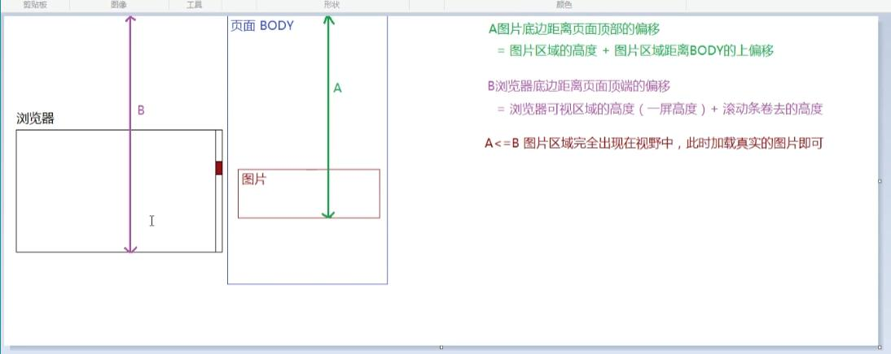

### 1. call和apply的区别是什么？那个性能更好一些
+ 相同点：
call和apply都是Function类的原型对象上公有的方法，每一个函数作为Funticon类的实例都可以调用这两个方法
call和apply都可以修改函数在运行时内部的this指向
call和apply都可以起到执行函数的作用，而bind不行，bind只可以在函数未执行的时候预先修改函数内部this指向。

+ 不同点：（传递参数时方式不同）
call方法的参数，第一个是函数在运行时重新指向的this，第一个后面的所有参数都必须以逗号的形式分隔，依次代表传入的实参。

apply方法的参数，第一个是函数在运行时的this指向，第二个参数是一个数组，数组中依次存放着传递给函数的实参。

+ call和apply的性能对比（网上看文章得来的）
在传递的实参在三个以内的时候，call和apply的性能大致相等
在传递的实参大于三个的时候，call的性能要比apply的性能高

+ 手写一个call方法，要在原型链上编程
```javascript
~function(){
	function myCall(context){
		context = context || window;
		let arr = [],
			result = null;
		for(let i=1;i<arguments.length;i++){
			arr.push(arguments[i]);
		}
		context.$fn = this;
		result = context.$fn(...arr);
		delete context.$fn;
		return result;
	}
	Function.prototype.myCall = myCall;
}();
```

+ 手写一个apply方法，要在原型链上编程
```javascript
~function(){
	function myApply(context){
		context = context || window;
		let arr = [],
			result = null,
			len = arguments.length;
		if(len > 1){
			arr = Array.from(arguments)[1];
		}
		context.$fn = this;
		result = context.$fn(...arr);
		delete context.$fn;
		return result;
	}
	Function.prototype.myApply = myApply;
}();


```
### 2. 如何测试一段代码的性能？
前提：任何的代码测试性能都和当前测试的环境有关系，因为当前电脑的CPU、GPU、内存等这些电脑硬件性能是一直变化的，其次在不同浏览器中进行测试也会导致结果不同，所以自己写的这个代码性能测试仅供参考。

+ 最简单的方法：时间戳方案 简单但是只能精确到整数的毫秒
let start = new Date();
for(var i=0;i<1000000;i++){
	
}
let end = new Date();
console.log(end - start)

+ 最常见的方法：console.time()以及console.timeEnd()
可以精确到小数点后12位
console.time('Time');
for(var i=0;i<1000000;i++){
	
}
console.timeEnd('Time')

### 3. 实现(5).add(3).minus(2),要求结果输出6
注意点：
+ 链式编程+立即执行函数封装的写法
+ 对传入参数的校验用check函数封装起来，如果不是有效数字,那么在传入参数的基础上加一个0，也不会对结果产生改变
+ this不能进行+=操作，也不能在三元表达式中写return后不跟任何东西
+ this是不能像变量的方式被赋值，只能改变this的指向
```javascript
~function(){
	function check(n){
		n = Number(n);
		return isNaN(n)? 0 : n;
	}
	function add(n){
		n = check(n);
		return this + n;
	}
	function minus(m){
		n = check(n);
		return this - m;
	}
	Number.prototype.add = add;
	Number.prototype.minus = minus;
}();

```
### 4. 箭头函数与普通函数的区别是什么？构造函数可以使用new操作符生成实例，那么箭头函数可以吗？为什么？

+ 箭头函数与普通函数的区别（4点）

1. 箭头函数的写法相对比普通函数来说比较简单，主要体现在：
可以省略function关键字
只有一个参数的时候可以省略小括号
如果函数的返回结果是一个return语句的时候，可以省略大括号

2. 箭头函数中没有arguments
箭头函数中没有arguments，是通过剩余参数运算符...args来获取函数中剩余参数的集合，它获取到的args本身就是一个数组，可以直接调用Array原型上的方法;
普通函数中通过arguments实参列表集合来获取所有传入的实参列表，注意这个arguments是一个类数组，需要转化成为数组之后再进行相关操作。

3. 箭头函数没有this
箭头函数没有this，其函数体内的this都指向该箭头函数自身所处上下文中的this。使用call、apply等任何方式都无法改变this的指向。

而普通函数中的this情况比较复杂：
1.有点的话是点前面的对象，否则为全局window，在严格模式下为undefiend
2.构造函数中的this，在new操作符执行函数的时候this指向类构造出来的实例
3.call、apply和bind都可以改变普通函数运行时的this指向
4.立即执行函数中的this一般都指向window
5.事件回调函数中的this指向当前被调用的DOM元素对象
6.回调函数中的this如果不去手动改变this的话，this一般默认指向window

4. 箭头函数没有prototype原型对象，因此不可以当做类来创建实例

+ 深究箭头函数不可以使用new来生成实例的原因
let Fn = ()=>{
	this.x = 666;
}
let fn = new Fn();
此时会报错：Uncaught TypeError：Fn is not a constructor

原因1：箭头函数中没有this，所以如果new一个箭头函数的话其内部的所有this都指向箭头函数本身所处上下文中的this了。
原因2：箭头函数没有prototype属性。每一个函数都有一个天生自带的属性prototype,这个属性的属性值是一个对象，里面存储着这个类所共有的属性和方法。
而我们又知道每一个函数的prototype对象中一定有一个天生自带的属性constructor，指向当前构造函数本身。

综上所述：箭头函数没有this和prototype，自然就没有prototype上的constructor属性，所以箭头函数不可以当做构造函数来创建对象。

### 5.实现一个each方法，要求有以下功能，练习回调函数(未完成 map和forEach结合版)
将老师讲回调函数的部分重新听一下
要求在原型链上编程
实现了这个，就等于变相的实现了比map和forEach更加全面的数组方法手写

let arr = [10,20,30,'aa',40];
let obj = {};
let newArr = arr.each(function(){
	// ==> this:指向obj 第二个参数不传 this是window
	// if(isNaN(item)){
		return false ==> 如果return的结果是false，则结束当前数组的循环
	}
	return item*10 ==> 返回的结果是啥，就把数组中当前项替换成啥
},obj)

### 6.实现一个replace方法，要求有如下功能，练习回调函数以及正则
实现和内置一样的效果
只考虑replace([reg],[callback])这种传参格式的处理
let str = 'zhufeng2019zhufeng2029';
str = str.replace(/zhufeng/g,function(...arg){
	//ARG中存储了每一次大正则匹配的信息和小分组匹配的信息
	return '@'; // 返回的是啥就把当前正则匹配的内容替换成啥
})

### 7.如何把一个字符串的大小写取反（大写变小写，小写变大写）

#### 如何区分一个字母为大写还是小写，有两种方法：
1. 通过每一个字符的ASCII码的字符区间来判断
小写字母a-z转化为Unicode十进制的数为97-122
大写字母A-Z转化为Unicode十进制的数为65-90

str.charCodeAt(index) 获取指定位置字符的uniCode编码值
str.charAt(index) 获取指定位置的字符
String.fromCharCode(Unicode编码值1,Unicode编码值2...) 获取Unicode编码值对应的字符

>>> 先匹配到一个字符串中的每一个字符，然后再将该字符看做一个单独的字符串，通过：str.charCodeAt(0)获取到该字符本身的unicode编码值，然后再根据区间进行判断是否为大小写。

2. 通过比较一个字符取大写之前和当前是否相等来判断，如果是说明以前本来就是大写；否则就是小写
str.toUpperCase() === str  那么字符str本身为大写

#### 具体实现的方法有两种
1.字符串挨个循环，然后挨个大小写取反后拼接到一起
缺点：不管是字母还是数字还是中文 都会遍历一遍 浪费性能
```javascript
function reverse(str){
	str = str.toString();
	let result = '';
	for(var i=0;i< str.length;i++){
		var item = str[i],
			itemUpperCase = item.toUpperCase();
			
		if(item === itemUpperCase){
			result += str[i].toLowerCase();
		}else{
			result += str[i].toUpperCase();
		}
	}
	return result;
}	
```
2.使用字符串replace方法，先用正则捕获，然后再替换（面试写这个）
优点：只处理字母，如果挨个遍历的话 中文和数字是没有大小写的 所以不好

拿正则匹配字母 拿replace替换
replace中的正则匹配多少次，里面的回调函数就会触发多少次
每一次会见正则匹配到的结果当作参数传递给里面的回调函数
```javascript
let str = '伟大领袖MAOzhuxi！！';
str.replace(/[a-zA-Z]/g,function(content){
	return content.toUpperCase() === content?content.toLowerCase():content.toUpperCase();
})
```
 

### 8.实现一个字符串匹配算法，从字符串S中，查找是否存在字符串T，若存在返回所在位置，不存在返回-1。(前提是不能基于内置的indexOf和includes等方法实现)
其实这道题就是indexOf方法的重写

思路一：
+ 循环当前字符串S的每一项，让每一项从当前位置向后截取T.length个字符
+ 然后挨个和T进行比较，如果一样，那么返回该索引i;否则返回默认值-1
```javascript
~function(){
	function myIndexOf(T){
		let lenT = T.length,
			lenS = this.length,
			res = -1;
		if(lenT > lenS) return res;
		
		for(var i=0;i<=lenS-lenT;i++){
			let char = this.slice(i,i+lenT)
			console.log(char);
			if(char === T){
				res = i;
				break;
			}
		}
		return res;
	}
	String.prototype.myIndexOf = myIndexOf;
}();
var str = 'abscg';
console.log(str.myIndexOf('cg') );

```

思路二：正则表达式
+ 字符串T转化为正则，需要使用new RegExp()来生成正则对象
+ 调用正则实例上的exec方法，如果匹配到，则返回一个类数组，里面有一个值index是所匹配到的第一个字符串的索引；如果没有匹配到那么返回null。
+ 验证一个值是否为null，要使用===全等来判断。
```javascript
~function(){
	function myIndexOf(T){
		let result = new RegExp(T).exec(this);
		console.log(result);
		return res = result===null? -1:result.index;
	}
	String.prototype.myIndexOf = myIndexOf;
}();
var str = 'absab';
console.log(str.myIndexOf('ab') );

```


### 9.对象的属性名可用类型的深入考察

```javascript
考察一个对象的属性名只可以是数字或者字符串
如果是数字，那么读取和写入的方法是obj[100]或者obj['100']
所以obj[100]和obj['100']代表obj对象中只有一个属性，值为'100'
因此后面的属性值c覆盖了前面的b

var a = {},
	b = 100,
	c = '100';
a[b] = 'b';
a[c] = 'c';
console.log(a[b]); 'c'

```

```javascript
考察数据类型Symbol创建的值是唯一的
Symbol创建的值是唯一的 类似于NaN 不等于自身
Symbol('123') === Symbol('123') false
typeof Symbol('123')==='symbol' true

var a = {},
	b = Symbol('100'),
	c = Symbol('100');
a[b] = 'b';
a[c] = 'c';
console.log(a[b]); 'b'

```

```javascript
考察引用类型的值当作对象属性时的内部隐式转换
为什么普通对象和数组对象转化为toString()的时候，转化结果不同
因为数组自身的原型对象Array.prototype上有toString方法
而对象自身的原型上也有Object.prototype上也有toString方法，用于检测数据类型
var a = {},
	b = {key:123},
	c = {key:'456'};
a[b] = 'b';
a[c] = 'c';
console.log(a[b]); 'c'

```


### 10.在输入框中如何判断输入的是一个正确的网址，例如：用户输入一个字符串，验证是否符合URL网址的格式（学了正则之后再来看）

let str = "http://www.yufukaka.cn/index.html?name=1&from=wx#video"
首先要搞明白一个正确的网址URL(统一资源定位符)由哪些构成，哪部分是必须要的，那部分是可以省略的：
只有域名不可省略，其他比如协议、路径、查询参数以及哈希值都可以被省略

```javascript
let str = "http://www.yufukaka.cn/index.html?name=1&from=wx#video"

let reg = /^(?:(http|https|ftp):\/\/)?((?:[\w-]+\.)+[a-z0-9]+)((?:\/[^/?#]*)+)?(\?[^#]+)?(#.+)$/i;
console.log(reg.exec(str))

得到一个数组，里面会将每一项都剖析出来。
0: "http://www.yufukaka.cn/index.html?name=1&from=wx#video"
1: "http"
2: "www.yufukaka.cn"
3: "/index.html"
4: "?name=1&from=wx"
5: "#video"

^和$代表以xxx开始，以xxx结束
?代表出现0到多次
\代表转义
i忽略大小写
\w代表数字字母下换线
+代表出现1到多位
?:代表只匹配不捕获
```
1.协议://
主流协议有http https ftp，后面一定是://
2.域名
域名以一个或多个点.隔开的，不一定是以www开头或者以com cn结尾
域名可以是数字 字母 下划线 中杠
www.baidu.com
bilibili.cn
kbs.sports.qq.com

3.请求路径
路径以一个或多个斜杠/隔开，斜杠后可以不加任何内容
/index.html
/user/index.html
/stu/
/

4.查询参数
以?号开始，使用键值对的方式传入参数，使用&符号进行分隔键值对
?xxx=xxx&yyy=yyy&zzz=zzz

5.哈希值
#xxx


### 11.考察函数的三个角色面试题(类似阿里面试题)
```javascript
function Foo(){
	Foo.a = function(){
		console.log(1);
	}
	this.a = function(){
		console.log(2);
	}
}

/* 把Foo当做类，在类的原型上设置一个公有属性a 通过实例.a()调用 */
Foo.prototype.a = function(){
	console.log(3);
}
/* 把Foo当做对象，添加一个私有属性a 通过Foo*/
Foo.a = function(){
	console.log(4);
}
Foo.a();  4
let obj = new Foo();
obj.a();  2
Foo.a();  1

```

### 12.编写代码 实现多张图片的懒加载
1. 为什么需要图片懒加载？
+ 因为图片懒加载是前端性能优化的重要方案
+ 通过图片或者数据的延迟加载，我们可以加快页面的渲染速度，让第一次打开页面的速度变快
+ 只有滑动到某个区域，我们才加载真实的图片，这样也可以节省加载的流量，为用户节省流量

2. 多张图片懒加载的处理方案

+ HTML和CSS
将所有需要懒加载的图片用一个盒子包裹起来，设置盒子的宽高和图片等宽高
设置图片的src属性为空
设置图片的dispaly为none
设置图片的自定义属性trueSrc，属性值为图片的真实路径
等待所有其他资源都加载完成之后，然后开始加载图片 监听window.onload事件
对于很多图片，需要当页面滚动的时候，当前图片完全显示到页面的可视区域中的时候，再加载真实图片
+ JS
监听window.scroll滚动事件
获取需要懒加载的图片其自身的高度以及距离body页面顶端的距离，加起来为H1（需要封装一个任意元素距离body元素的偏移距离的方法，不管其父元素是否为定位元素）
实时获取当前页面body被卷去的高度以及浏览器一屏幕的高度，加起来为H2
当H2>=H1的时候，此时图片一定在页面中间完全显示了，此时需要先获取图片的自定义属性trueSrc，将该属性值赋值给img的src属性
为了避免赋值的是错误的属性，需要监听图片的加载完成事件onload触发之后，此时再让图片的display显示。
注意通过setAttribute()方法给一个元素设置属性的时候，无论属性值是什么数据类型最终获取的时候都是字符串类型的，所以最好不要用全等。
当一个盒子中的图片已经加载过了，那么需要设置一个自定义属性来记录已经加载成功，当下次再触发该事件的时候，就可以提前终止后续事件处理函数的执行，提高性能。
```javascript
/*封装一个任意元素距离body元素的偏移距离的方法*/
function getOffset(ele){
	// 先求ele的父级定位元素以及ele的相对其父级定位元素的偏移量
	let parent = ele.offsetParent,
		offsetW = ele.offsetLeft,
		offsetH = ele.offsetTop;
	// 如果传入的是body元素，body的父级定位元素是null，此时不用循环获取
	// 如果一个元素没有父级定位元素或者它的父级定位元素就是body，那么它的offsetParent一定是body元素,所以也不用循环去获取了
	while(parent && parent.tagName !== 'BODY'){
		if(window.navigator.userAgent.indexOf('MSIE 8.0') === -1){
			offsetW += parent.clientLeft;
			offsetH += parent.clientTop;
		}
		offsetW += parent.offsetLeft;
		offsetH += parent.offsetTop;
		parent = parent.offsetParent;
	}
	return{
		offsetW,
		offsetH,
	}
}

let imgboxs = document.querySelectorAll('.imgbox'),
	html = document.documentElement;
function loadImage(){
	let H2 = html.scrollTop + html.clientHeight;
	imgboxs.forEach(item=>{
		let H1 = item.offsetHeight + getOffset(item).offsetH;
		if(H2 >= H1 && item.getAttribute('isLoad')!=='1'){
			item.setAttribute('isLoad',1);
			var img = item.querySelector('img');
			let value = img.getAttribute('data-trueSrc');
			img.src = value;
			img.onload = function(){
				img.style.display = 'block';
			}
		}
	})
}
window.onscroll = loadImage;  // 滚动时需要懒加载
window.onload = loadImage;    // 所有资源加载完的时候需要懒加载


```

### 明日学习计划
综合面试题 跳过正则表达式的题目 等学了正则之后再来做
2-10 正则
2-12 正则
数组扁平化
数组合并
对象的Object.defineProperty总结及小野老师讲的一些关于该知识点的题目
类数组的应用

数组的数字字符串属性会被转化为索引，索引和length是映射的
冒泡排序
插入排序
快速排序
数组交集
数组旋转

函数curry化及其应用 bind

### 13.实现一个$attr方法,参数为name和value
name代表属性，value代表属性值
要求执行一次该方法可以获取页面中所有属性名为name，值为value的元素集合
本质就是重写一个元素的属性选择器

+ 获取页面中所有标签元素集合可以用getElementsByTagName或者querySelectorAll,前者获取到的是HTMLCollection,后者获取到的是NodeList，但都是类数组，不可以直接调用数组的循环方法。

+ 类数组调用数组的几个方法(三个转化 一个for循环 一个call借用)
1.Array.from(arrayLike); ES6新增方法 最简单
2.Array.prototype.slice.call(arrayLike); 利用call和slice的参数为空的时候返回原数组的浅克隆原理
3.let newArr = [...arrayLike]
4.利用最原始的for循环 虽然原始但是性能最高且兼容性最好
5.[].forEach.call(arrayLike); 让类数组借用数组的forEach去做一些事情

+ 考虑class属性边界值及特殊情况
当属性名为class的时候，如果一个元素的属性值为'demo'、'demobig'、'demo big'
那么如果采用全等的方法去验证 很明显第三个无法被获取到
如果采用indexOf或者includes的方法去验证 很明显第二个连着的会被错误的获取到
所以需要采用强大的正则表达式来进行获取

+ 正则表达式如何判断
将字符串转化为正则表达式 需要采用new RegExp()的方法转化
要求属性值前后都没有值 \b + value + \b
由于字符串\单独写需要转义，所以还需要再加一个\

```javascript
function $attr(name,value){
	// 获取页面所有标签元素集合HTMLCollection
	let elements = document.getElementsByTagName("*"),
		result = [];
	
	// 类数组转数组，方便使用数组方法或借用数组方法
	[].forEach.call(elements,item=>{
		let itemValue = item.getAttribute(name);
		if(name === 'class'){
			//字符串\需要转义才代表\
			let reg = new RegExp("\\b"+ value +"\\b");
			reg.test(itemValue)?result.push(item) : null;
			return;
		}
		if(itemValue === value){
			result.push(item);
		}
	})
	
	// 返回校验后的元素集合
	return result;
	
}
let a =  $attr('class','demo' )
console.log(a);

```


### 14.一个由英文字母汉字组成的字符串，要求用正则给英文单词前后加空格

### 15. 数组扁平化(详见数组扁平化的五种方案)
编写一个程序，实现以下功能
1.将数组扁平化
2.去除其中重复部分数据，数组去重
3.将数组各项升序
let arr = [[1,2,2],[3,4,5,5],[6,7,8,9[11,12,[12,13,[14]]]],10]

```js
let arr = [[1,2,2],[3,4,5,5],[6,7,8,9,[11,12,[12,13,[14]]]],10];
let newArr = [...new Set(arr.flat(Infinity).sort((a,b)=>a-b))];
console.log(newArr);
```

### 16.手写一个new方法，参数为构造函数和函数的实参

```js
@parmas Constructor构造函数
		args为构造函数所接收的实参集合
		
@return 返回一个构造函数的实例对象

function myNew(Constructor,...args){
	let obj = {};
	obj.__proto__ = Constructor.prototype;
	<!-- 或者采用Object.create方法 一句顶上面两句 -->
	let obj = Object.create(Constructor.prototype)
	
	
	Constructor.call(obj,...args)
	return obj;
}
```

```js
function Person(name){
	this.name = name;
}
Person.prototype.say = function(){
	console.log('my name is' + this.name);
}
Person.prototype.eat = function(){
	console.log(8888888888);
}
let a = myNew(Person,'小花');

console.log(a.say());   my name is小花
console.log(a.eat());   8888888888
console.log(a instanceof Person); true
```

### Object.create(proto)方法的使用
参数：   proto是一个对象，多数情况下是一个类的原型对象
	    该方法要求必须传入参数
返回值： 返回一个空对象
		
作用：   创建一个空对象，让空对象作为proto对象所属类构造函数的一个实例
也就是说空对象newObj的原型链的上一级是proto对象，newObj继承了来自proto对象上的所有属性和方法。
```js
function Person(name){
	this.name = name;
}
Person.prototype.say = function(){
	console.log('my name is' + this.name);
}
Person.prototype.eat = function(){
	console.log(8888888888);
}

let newObj = Object.create(Person.prototype);
console.log(newObj);
newObj.say();
newObj.eat();

```

### 17.数组合并
主要用到了以下几个知识点：
数组的map方法给arr2每一项后面补一个z，用于排序的时候排在后面
数组的concat方法合并数组
数组的sort方法结合字符串的localeCompare方法对数组进行排序
字符串的replace方法

```js 采用数组api实现
let arr1 = ['A1','A2','B1','B2','C1','C2','d1','d2'];
let arr2 = ['A','B','C','D'];

要求将两个数组合并成为一个新数组,样式如下：
['A1','A2','A','B1','B2','B','C1','C2','C','d1','d2','D'];

arr2 = arr2.map(item=>item + 'Z');
let newArr = arr1.concat(arr2).sort((a,b)=>a.localeCompare(b));
newArr = newArr.map(item=>{
	return item.replace('Z','');
})
console.log(newArr);

```

```js 采用双重for循环的插入排序实现
内层循环的目的就是将找出arr2中每一项在arr1中要插入的位置的索引 
外层循环的目的是将找到的索引，利用数组splice方法插入

let arr1 = ['A1','A2','B1','B2','C1','C2','D1','D2'];
let arr2 = ['A','B','C','D'];

let k = 0;
for(let i=0;i<arr2.length;i++){
	let item2 = arr2[i];
	for(let j=0;j<arr1.length;j++){
		let item1 = arr1[j];
		if(item1.includes(item2)){
			k = j;
		}
	}
	arr1.splice(k+1,0,item2)
}
console.log(arr1);

```


>>>字符串的localeCompare方法
str.localeCompare(paramsString)
+ 将str理解为一个强大的参照物，等着别人来比较挑战
+ 将传入的参数paramsString理解为一个挑战者
如果挑战成功，那么挑战者就要排到参照物前面去，此时返回1
如果挑战失败，那么挑战者还是跟在参照物屁股后面，此时返回-1
如果平手，那么返回0

>>> 利用localeCompare方法和sort方法，可以实现对中文字符串进行排序
注意localeCompare只适用于字符串，对数字无效
arr.sort(function(a,b){return a.localeCompare(b)}); //正序排列 
arr.sort(function(a,b){return b.localeCompare(a)}); //反序排列

### 18.定时器的异步编程，求输出结果及优化方案（bind预绑定传递参数）
for循环是同步执行的，定时器是异步执行的，只有等待主执行栈中的所有同步代码执行完成之后，才去消息队列中执行异步代码。
而定时器中的i按照作用域查找机制，向上一级作用域查找，也就是全局，此时i已经变成了10
```js
for(var i=0;i<10;i++){
	setTimeout(()=>{
		console.log(i);
	},1000)
}
```
优化方案有四条：
1. 将var修改为let，let声明的变量具有块级作用域
每一次循环都会在当前块级作用域中存储一个私有变量i,当定时器触发的时候，所使用的i就是当前定时器所处块级作用域中的私有变量i

2. 立即执行函数生成闭包
将每一次循环的索引i都保存在立即执行函数的函数作用域中，当定时器触发的时候，使用的是私有的i
```js
for(var i=0;i<10;i++){
	(function(j){
		setTimeout(()=>{
			console.log(j);
		},1000)
	})(i)
}
```

3. 大函数执行retrun一个小函数，return出去的小函数中的变量j由于闭包的存在，始终保持着对于上一级作用域中i的引用，会导致作用域无法销毁。这是闭包的另外一种写法。
```js
for(var i=0;i<10;i++){
	setTimeout((function(j){
		return function(){
			console.log(j);
		}
	})(i),1000)
}

```

4. 基于bind()方法的预先处理机制
fn.bind(thisArg,args)
bind方法的作用为函数fn在执行前预先将函数的this修改为thisArg对象以及预先给函数传递一系列参数
bind方法的返回值是一个被处理后的新函数
bind方法会改变this指向，但是是在函数执行之前，并且bind不会起到执行函数的作用
bind方法一旦为一个函数绑定了this新指向以及参数，那么得到的新函数再去传递参数就无效了
```js
预先将要打印的i传递给函数fn，定时器触发后才可以显示0-9
let fn = (i)=>{console.log(i)}
for(var i=0;i<10;i++){
	setTimeout(fn.bind(null,i),1000);
}
```


### 19.匿名函数设置了函数名的特殊情况
在JS中，一个原本是匿名的函数如果出乎意料的设置了函数名的时候，会有以下情况：
+ 首先JS中出现匿名函数最多的有两个场景：
1. 函数表达式   let fn = ()=>{};
2. 立即执行函数 (function(){})();

+ 特殊情况
1. 匿名函数的名称A在外部不可以调用，如果调用A(),那么会返回A is not defiend
2. 匿名函数的名称A在函数内部可以访问，访问的结果是函数本身，函数的代码字符串"f A(){...函数体}"
3. 匿名函数的名称A可以看做是被const声明的常量，在函数内部给A重新赋值的时候
如果是非严格模式，不会报错也不会产生任何效果；
如果是严格模式下，会报类型错误：Uncaught TypeError: Assignment to constant variable.


```
let fn = function A(){
	A = 100;
	console.log(A) 访问全局A，根据作用域链查找机制
}
fn(); 打印函数体代码字符串
A(); A is not defiend

```

+ 面试题目
```js
var b = 10;
(function b (){
	b=20;
	console.log(b);  输出函数体的代码字符串
})();
console.log(b);  输出10

```

### 20. 如何让a==1&&a==2&&a==3 Object.defineProperty(obj,value,{})的应用
思路一：基于对象和数字进行==比较的时候，会先调用对象上的内置方法valueOf或者toString方法转化为基本数据类型的值，然后在将基本类型的值转化为数字类型，最后进行比较。
核心：将a声明为对象类型，然后重写a对象上的valueOf方法
	  在每一次进行==比较的时候，JS底层都会隐式的去调用对象的valueOf和toString方法
	  对象如果自身重写了toString方法，那么就不会再去原型链上找toString方法了
```js

let a = {
	value:1,
	valueOf:function(){
		return this.value++;
	}
}
if(a==1&&a==2&&a==3){
	console.log(1);
}

```

思路二：基于数组的shift方法会返回被删除的项，并修改原数组的特点
核心：  将数组的toString方法指向数组的shift方法，在进行隐式转化的时候调用数组的toString方法，等于变相调用了数组的shift方法，等于借用了数组的shift方法
```js
var a = [1,2,3];
a.toString = a.shift;
if(a==1&&a==2&&a==3){
	console.log(1);
}

```


>> 总结：思路一和思路二本质上还是通过引用类型的值在和数字比较的时候出隐式转化，隐式转化的过程中会调用自身的toString或者valueOf方法，我们通过给对象本身重写toString方法为其私有属性的方法来解决。

思路三：基于Object.defineProperty()方法来定义对象中某一个属性的get函数
核心：将该方法操作的对象看做window，将a看做window对象上的一个属性
	  Object.defineProperty()方法的第三个参数中的get函数代表一个变量被访问的时候触发
```js

Object.defineProperty(window,'a',{
	get:function(){
		console.log(this); get里面的this指向winbow
		this.value ? this.value++ : this.value = 1;
		return this.value;
	}
})
if(a==1&&a==2&&a==3){
	console.log(1);
}

```

### 21. Object.defineProperty的另外三道面试题

1. 要求以上代码执行的时候，可以输出如下结果：
console.log(_ + _ + _ + _); 输出字符串'abcd'
console.log(_ + _ + _ + _ + _); 输出字符串'abcde'

核心：1.将下划线_看做window对象上一个特殊的属性名称
	2.每一次访问_属性的时候，就劫持并将_转化为对应的字母a...z
	3.字符串中单个字符转ASCII码的方法 str.charCodeAt(index) 返回的值一定是数值 超出范围返回NaN
	4.字母a-z的编码值为97-122
	5.ASCII码转为字符串的方法 String.fromCharCode(num1,num2) 返回的是编码对应的字符串（静态方法 必须以String开头）
	
```js
Object.defineProperty(window,'_',{
	get(){
		// console.log(this); get里面的this指向window 等于在window上新增了一个属性 必须用this 不能用变量声明
		// 有值就用值，无值用a的编码值当做初始值
		this.codeValue = this.codeValue || 'a'.charCodeAt(0);
		// 根据编码值得到字符串中的字符
		let strValue = String.fromCharCode(codeValue);
		// 超出z值的编码范围就return 不往下执行
		if(this.codeValue >= 'a'.charCodeAt(0) + 26)return;
		
		this.codeValue ++ ;
		return strValue;
	}
})
console.log(_ + _ + _ + _ + _)  //打印abcde	


```

2. 要求在给a赋值的时候控制台打印不同的信息，或者抛出错误信息
a  = 'Object';
{
	type:'Object',
	length:6
}

a = 'Array';
{
	type:'Array',
	length:5
}
赋值一定是劫持set函数，set函数可以接受一个参数value，该参数就是赋值的值
set函数中的this指向Window
```js
Object.defineProperty(window,'a',{
	set:function(value){
		this.obj = {};
		switch(value){
			case 'Object':
			case 'Array':
				obj.type = value;
				obj.length = value.length;
				console.log(obj)
				break;
			default:
				throw new Error('你的输入有误')
		}
	}
})


```

3. 定义一个对象newObj，实现另外一个对象的值:希望操作之后 打印的newObj对象中三个属性的值是 3 3 5
// 给obj中的属性k（也就是a b c）依次绑定一个Object.defineProperty方法
// 该方法将每一个属性的值定义为原来_obj对象中对应值+1
// 也就是经过这一层操作 obj对象已经变成了{a:2;b:3;c:4}
// 在这里遍历obj中的key，首先要确保k是可遍历的 上面必须要设置enumerable:true 而且值也可以修改writable:true,
// 因为默认调用该方法会将除了value的其他三个内部特性设置为false 也就是不可修改不可删除不可遍历不可以重新定义属性内部特性
```js
var _obj = {
   a:1,
   b:2,
   c:3
}
var obj = {};

for(let key in _obj){
	Object.defineProperty(obj,key,{
		value: ++_obj[key],
		writable:key=='b'?false:true,核心代码
		enumerable:true
	})
}

for(let key in obj){
	obj[key] += 1;
}
console.log(obj); 3 3 5


```

### 22. 类数组易错面试题 重写数组push方法

```js
let obj = {
	2:3,
	3:4,
	length:2,
	push:Array.prototype.push
}
obj.push(1); obj[obj.length] ==> obj[2] = 1;==>obj.length = 3;
obj.push(2); obj[obj.length] ==> obj[3] = 2;==>obj.length = 4;
console.log(obj);
{
	2:1,
	3:2,
	length:4,
	push:Array.prototype.push
}
```

这道题的关键时弄懂Array.prototype.push方法的源码：
要注意在末尾增加一项之后，浏览器会自动给当前执行该方法的对象的length属性的值+1；这个操作是不需要我们考虑的，因为浏览器已经在底层实现了。
```js
Array.prototype.mypush = function(...args){
	for(var i=0;i<args.length;i++){
		this[this.length] = args[i];
	}
	return this.length;
}

```

### 23. 对象和数组的转化面试题
给定下面一个对象obj，要求转化为下面的数组。对象中是一个公司1-12月的业绩
var obj = {
	1:22,
	2:123,
	5:888
}
要求操作之后变为：[222,123,null,null,888,null,null,null,null,null,null,null]

```js
var arr = new Array(12);
var arr1 = [];
for(var i=1;i<=arr.length;i++){
	console.log(i);
	obj[i]? arr1.push(obj[i]):arr1.push(null);
}

console.log(arr1);
```

```js
var arr = Array.from({length:12}).fill(null);
arr = arr.map((item,index)=>{
	return obj[index+1]||null;
})
console.log(arr);
```

```js
obj.length = 13;
console.log(obj);
var arr = Array.from(obj).slice(1).map((item,index)=>{
	return typeof item==='undefined'?null:item;
})
console.log(arr);
```

```js
var arr = new Array(12).fill(null);
Object.keys(obj).forEach(item=>{
	arr[item-1] = obj[item]; 
})
console.log(arr);
```


### 24. JS中将两个数交换值，有哪些方法（5种方法）？
var a = 100，b=200;要求交换两个值的位置

1. 最原始的 创建原始变量 交换位置
var temp = null;
	temp = a;
	a = b;
	b = temp;

2. 最简单的 ES6数组解构赋值 
[b,a] = [a,b]

3. 数组法
a = [a,b];
b = a[0];l
a = a[1]

4. 对象法
a = {
	a:b,
	b:a
}
b = a.b;
a = a.a;

5. 保存和法
a = a + b; 此时a为两数之和300 b还是200
b = a - b; 此时a为两数之和300 b变为100 b已经完成交换
a = a - b; 此时a为200 a完成交换

### 25.求两个数组的交集、差集、补集、并集
交集：两个数组所共有的元素集合
并集：两个数组合并之后去重
差集：所有属于A数组且不属于B数组组成的集合
老师讲的解决方案有问题 下来还需要自己再看

### 26.旋转数组的几种方法
给定一个是数组，将数组中的元素向右移动K个位置，其中K是非负数
输入：[1,2,3,4,5,6,7]和k = 3
返回：[5,6,7,1,2,3,4]

解释：
向右旋转一步：[7,1,2,3,4,5,6]
向右旋转二步：[6,7,1,2,3,4,5]
向右旋转三步：[5,6,7,1,2,3,4]

```js
function rotate(arr,k){
	var len = arr.length;
	if(len<=1)return arr;
	for(var i=0;i<k;i++){
		arr.unshift(arr.pop(arr[len-1]));
	}
	return arr;
}
```

```js 把倒数第k位排到前面，在将数组合并
function rotate(arr,k){
	var len = arr.length;
	if(len<=1)return arr;
	return arr.splice(len-k).concat(arr);合并数组方法一
	return [...arr.splice(len-k),...arr];合并数组方法二
}
```

```js
function rotate(arr,k){
	var len = arr.length;
	if(len<=1)return arr;
	new Array(k).fill(null).forEach(()=>{
		arr.unshift(arr.pop(arr[len-1]));
	})
}
new Array创建的空数组必须通过fill方法填充一些内容才可以进行循环，空数组是无法循环的。

```

### JQuery中的$(document).ready(callback)方法和window.onload事件处理函数的区别
原生JS并没有自带document.ready方法，所以需要自己封装
```javaScript
document.ready = function (callback) {
	///兼容FF,Google
	if (document.addEventListener) {
		document.addEventListener('DOMContentLoaded', function () {
			document.removeEventListener('DOMContentLoaded', arguments.callee, false);
			callback();
		}, false)
	}
	 //兼容IE
	else if (document.attachEvent) {
		document.attachEvent('onreadystatechange', function () {
			  if (document.readyState == "complete") {
						document.detachEvent("onreadystatechange", arguments.callee);
						callback();
			   }
		})
	}
	else if (document.lastChild == document.body) {
		callback();
	}
}
```

document.ready(callback)表示文档结构已经加载完成（不包含图片等非文字媒体文件）；
window.onload 指示页面包含图片等文件在内的所有元素都加载完成。


### 发现资源三条
GITHUB：JS深度专题系列
https://github.com/mqyqingfeng/Blog/labels/%E4%B8%93%E9%A2%98%E7%B3%BB%E5%88%97

面试题合集：
http://www.520mg.com/plus/view.php?aid=9607

木易杨前端100问 都是些比较有难度的大厂题目
https://github.com/yygmind/blog/issues/43

### css技术 巧用padding的百分比值 完成有图片盒子布局
做到不考图片本身就能把容器的高度撑开
首先一般情况下盒子的高度都是由内容去撑开的，但是一旦盒子中含有图片的时候，图片的加载需要时间，在图片加载前图片的高度为0，图片加载完成之后高度为自身高度，所以会导致盒子的高度在图片加载前后有一个跳动，这对于页面刷新时的前端界面来说非常不友好，所以我们一般情况下提供两类方法：

1. 给图片外面包裹一个盒子，给该外层盒子设定图片的固定宽高和溢出内容隐藏，并且设置该盒子下的图片宽高为100%，也就是和外层父元素等宽等高

2. 图片盒子高度继承自父元素，宽度使用height：0 + padding：百分比来决定图片的高度等于父元素宽度的占比，然后设置内部img图片的宽度为100%，外部图片盒子溢出内容隐藏。


### 字节前端css面试题：利用css实现一个div水平垂直居中的同时，该div的高度永远是自身宽度的一般，宽度可以不固定。
+ margin和padding的值为百分比的时候，是基于其最近的块级父元素的宽度来计算的，四个方向都是这样计算的，要注意top和bottom也是基于宽度来计算而不是高度。

+ 子元素的宽度width和高度height为百分比的时候，是基于包含它的块级对象的高度和宽度来计算的。


div的宽度可以是100%继承自父元素的宽度
div的高度永远是自身宽度的一半，可以使用子元素的padding-bottom为50%的时候，是基于父元素的宽度来决定的，这也是一种父元素的宽度可以影响子元素的高度的方法。

让父元素自身开启绝对定位并且水平垂直居中 absolute+transform属性
父元素开启flex布局，设置内部子元素垂直居中，等于变相设置了子元素在页面中水平垂直居中
父元素定宽，子元素宽度继承100%；高度为0，用padding-bottom：50%来实现
此后，父元素的宽度变化，子元素的宽度和高度会随着一起变化

```html
<div class="parent">
	<div class="son">
		
	</div>
</div>
```

```css
.parent{
	width: 500px;
	background-color: #FFAA00;
	position: absolute;
	top: 50%;
	left: 50%;
	transform: translate(-50%,-50%);
	display: flex;
	align-items: center;
}
.son{
	width: 100%;
	height: 0;
	padding-bottom: 50%;
	background-color: #FFBBD5;
}

```

