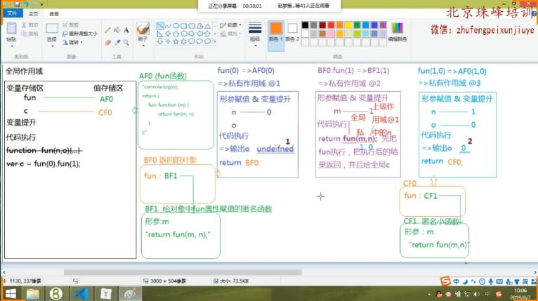

### 函数创建和函数执行时的流程
>>> 函数被创建时：
1.开辟一个堆内存，将函数体当做代码字符串存储在堆内存中
2.将堆内存的16进制内存地址赋值给栈内存中的函数名/变量名
3.函数的上一级作用域和被创建时的位置有关，和调用函数执行时的位置无关
4.函数在哪里创建，其执行时的上一级作用域就是函数创建的作用域

>>> 函数被执行时：
1.创建一个函数执行时全新的私有作用域，多次执行创建多个互不影响的作用域
2.变量提升和形参赋值
3.代码执行，将原先存储在堆内存中的代码字符串拿出来放到当前作用域下一行行执行
4.遇到一个变量，首先看是否为当前作用域下的私有变量（如何判断？看是否在当前作用域中使用var let const function声明或者是否为形参）,是私有变量就直接操作即可，不是私有变量则向上级作用域中查找，直至查找到作用域的最顶端全局作用域，这是作用域链的查找机制。
5.私有变量和外界变量无必然关系，可以理解为被私有作用域保护起来了，这种机制其实就是闭包的保护机制。


### 小拓展：前置递增和后置递增运算符的结果
1.不管是++i还是i++,它首先是一个表达式，只要是表达式就必须有返回值。
2.i++;也就是后置递增运算符，其表达式的返回结果还是i的值，此时i变量的值变为i+1的值
3.++i;也就是前置递增运算符，其表达式的返回结果是i+1的值，此时i变量的值变为i+1的值

var a = 10;
console.log(a++,a) 10,11
console.log(++a,a) 12,12

var b = 100;
console.log(100 + (b++)); 200
console.log(b);  101

console.log(100 + (++b)); 202
console.log(b);  102

### 关于堆栈内存释放机制（以谷歌webkit浏览器为例）
当前作用域中的东西被当前作用域以外的东西给占用了，导致当前作用域不能被销毁，导致内存泄漏。作用域不销毁，作用域中变量存储区域和值存储区域的数据就不会销毁。


函数只要执行就会从内存空间中分配一块空间当做当前函数执行的私有作用域(栈内存),但是如果每次函数执行后都不释放内存，那么很容易导致栈内存溢出的问题，所以了解和学习堆栈内存的释放机制是学习JS的核心之一。

1.堆内存释放机制
每当创建一个引用类型的值，就会产生一个堆内存
浏览器自动释放堆内存：
如果当前创建的堆内存不被变量所引用了，浏览器会在空闲的时候查找每一个内存的引用状况，已经不被变量所引用的堆内存会被回收释放。

手动释放堆内存：将对象的引用指向空对象指针null
```
let obj = {
	name:"zhangsan",
}
obj = null;
```

2.栈内存释放机制
浏览器引擎解析和执行代码的全局作用域是栈内存
函数执行时形成的函数私有作用域是栈内存
基于ES6中的let和const形成的块级作用域也是栈内存

全局栈内存：只有关闭当前页面的时候才会销毁
函数栈内存
1.一般情况下，函数执行完成之后函数栈内存就会被立即销毁(排除递归死循环的情况)
2.一旦函数私有作用域中的某个东西(一般都是堆内存地址)被当前私有作用域之外的某个事物所占用了，那么这种情况下函数的栈内存是不能被释放销毁的，同时栈内存不能销毁的特点就是当前私有作用域中的私有变量等信息会被保留下来。

比如A函数的执行结果是return B函数，恰好外部变量x接收了A函数执行的结果，那么此时A函数执行时形成的私有栈内存不可销毁。因为函数return的一定是一个确定的值，当值为引用类型的时候return的其实是引用值的16进制内存地址，所以全局变量x接收到的也是这个内存地址，此时x变量始终保持着对于该引用地址所指向堆内存的引用，所以函数A执行时形成的私有栈内存无法销毁。

```javascript

function A(){
	return function B(){
		console.log('888');
	}
}
var x = A();

全局作用域中的x变量始终保持着对于函数A作用域中B函数的引用，所以函数A执行后形成的私有栈内存不可销毁。
```


### 到底TMD什么是闭包？

当某个函数执行时形成不能被释放的私有栈内存，这种现象或者机制叫做闭包。
比如当一个函数当做某个函数A的参数被传入；或者当做某个函数A的参数被返回，都会导致函数A在执行之后形成的私有栈内存无法被销毁，此时就形成了闭包。

面试官问：请按照你的理解讲一下闭包？
答:分为三个步骤回答：1.闭包是什么？2.闭包有什么用？什么情况下会形成闭包

1.闭包是什么？
我对闭包有两种理解。
第一种理解是函数在执行时会形成一个全新的函数私有作用域，该私有作用域保护了其内部的私有变量和外界东西互不干扰，这种保护机制叫做闭包。
第二种理解是当某个函数在执行时形成不能被销毁的私有栈内存，该私有栈内存中的私有变量和其他信息会被一直保存起来而不被销毁，这种保存私有变量的机制叫做闭包。

2.闭包的作用
也就是上面所说的保护私有变量不被外界所干扰
保存函数颞部私有变量不被销毁。

3.闭包是如何产生的
一个函数被当做函数传入到另外一个函数中
一个函数被当做俩一个函数的返回值，并且在外部有变量接收了这个返回值
当函数中有函数嵌套的时候，此时会产生闭包，闭包的保护机制

4.闭包在实际项目中应用(见下文)
我自己在项目中哪些地方使用了闭包...，比如来说，我再项目中解决某个业务的时候利用闭包解决了某个问题

防抖节流
bind内部实现 柯里化函数也实现了闭包
循环绑定事件

我封装组件的时候用到了闭包

我看别人写的代码和类库的时候看到别人的哪些地方使用了闭包

5.闭包的弊端有哪些
闭包会导致函数的私有栈内存无法被回收释放，从而导致内存泄漏降低性能。所以要尽量减少闭包的使用。

### 闭包面试题(重点考察堆栈内存释放机制和闭包应用)
```
var i = 5;
function fn(i){
	return function(n){
		console.log(n + (++i));
	}
}
var f = fn(1); 
f(2); 
fn(3)(4);
fn(5)(6);
f(7);
console.log(i);
 执行结果依次为:4 8 12 10 5
```

```
var i = 20;
function fn(){
	i-=2;
	return function(n){
		console.log((++i) - n);
	}
}
var f = fn();
f(1);
f(2);
fn()(3);
fn()(4);
f(5);
console.log(i);

 执行结果依次为:18 18 16 14 14 19
```

### 小拓展：同一作用域下同一变量名的提升问题
在相同的作用域下，如果分别用var和function声明了一个同名变量a，那么有以下问题？
1.在预编译阶段谁先进行变量提升？
答：
+ 在预编译阶段函数声明提升要优先于变量提升，这是一个大的前提，因为在js中函数是一等公民。
+ 其次函数的提升会将声明和赋值全部完成，而变量var提升只会进行变量声明。
+ 最后如果一个变量(a)已经被声明过了，那么后面遇到相等变量名(a)的声明则直接跳过，只进行赋值的相关操作。

由以上三点可知：函数a和变量a都会进行提升，先提升function声明的函数，那就是：
```
function a(){
	console.log(888);
}
var a;
console.log(a); 
a = 100;
console.log(a); 
```
经过这一步已经完成了a变量的声明和赋值，值为一个引用值函数，存放在堆内存中。
后面就算变量声明var a = 100;提升了，但是由于a已经被声明了，所以第二次声明直接跳过。
然后给a变量重新赋值100

2.在执行阶段两个log都打印什么值？

前后两次打印的值：(在谷歌浏览器中验证正确)
第一次：function a(){console.log(888);}
第二次：100

```javascript

console.log(a);  
function a(){
	console.log(888);
}
var a = 100;
console.log(a); 

```

### 闭包应用之保护
### 闭包应用之保存私有变量（重温选项卡案例）
之前解决思路：自定义属性方法
使用作用域链思路解释为什么直接绑定changeTab(i)会失败


### 闭包应用之保护私有变量(防止全局变量污染)
闭包的保护机制可以防止全局变量污染
比如我们导入了一个类库或者自己封装的方法库，如果这个库里面的方法名不保护起来，那么用户自定义的方法名如果和类库中的方法名相同的话，就会产生命名冲突，也可以理解为全局变量污染,所以这个类库中的方法和变量需要利用闭包保护起来。

但是光保护起来，外边如何调用你封装的库里面的方法呢，这时候我们就需要将我们封装的私有方法暴露给全局，供全局使用，方法见下。

``` javascript
(function(global,factory){
	
})(typeof window !== 'undefined'?window:this,function(window,noGlobal){
	var jQuery = function(a,b){
		// ...诸多方法
	}；
});

```

在真实项目开发中，要尽可能的避免使用全局变量，将自己命名的变量和方法名放到立即执行函数中,利用闭包的保护机制将这些私有变量保护起来，避免产生全局变量污染。
```
var xxx = ~function(){
	// A开发时写的代码，通过return暴露给全局
	return varibale/method;
}();

~function(){
	//B开发时写的代码，通过添加至全局window暴露给全局
	window.yyy = varibale/method;
}();


```


### 将一个函数私有作用域中的变量或方法暴露给全局的方法
1.通过return私有方法到外部，然后外部通过全局变量接收
```javascript
function demo(){
	var name = 100;
	function add(a,b){
		return a+b;
	}
	return add;
}

var result = demo();
result(10,20); 结果是10+20 = 30
```
2.通过给全局window对象增加属性，把私有的方法暴露到全局作用域中供全局调用
```
function demo(){
	var name = 100;
	function add(a,b){
		return a+b;
	}
	window.add = add;
	或者
	window.$ = add;
}
demo();执行一次demo()函数将demo函数中私有的方法add暴露到了全局，然后全局就可以调用了
add(10,20);返回30
$(20,40);  返回60

```
### 闭包经典面试题，5个li绑定点击事件依次输出其索引i
4种解决方案
1.let
2.立即执行函数+闭包作用域保存变量功能
3.自定义属性+this指向
4.Array.prototype.forEach((item,index)=>{})
```html
<div id="btns">
	<input type="button" class="btn-1" value="1">
	<input type="button" class="btn-2" value="2">
	<input type="button" class="btn-3" value="3">
	<input type="button" class="btn-4" value="4">
	<input type="button" class="btn-5" value="5">
</div>
```

```javascript
var btns =document.querySelector('#btns');
var inputs = document.querySelectorAll('input');
var length = inputs.length;
1.自定义属性(给点击项添加)和this指向当前点击项 效率最高
for(var i = 0; i < length; i++){
	inputs[i]. _index = i;
	inputs[i].onclick = function(){
		alert(this._index)
	}
}

2.简单粗暴let 利用let的块级作用域
for(let i = 0; i < length; i++){
	inputs[i].onclick = function(){
		alert(i)
	}
}
3.以下三个都是利用闭包的保存功能,只不过写法不一样（只有前两个是对的）
正确写法：简单粗暴全包立即执行函数 一般不用 性能低
for(var i = 0; i < length; i++){
	(function(j){
		inputs[j].onclick = function(){
			alert(j);
		}
	})(i);
}

正确写法：闭包return 利用保存私有变量功能
for(var i = 0; i < length; i++){
	inputs[i].onclick = (function(j){
		return function(){
			alert(j);
		}
	})(i);
}

闭包不return(错误写法)：但是会立即弹出，页面一刷新就弹出，有疑问,这样等于给点击事件绑定的还不是函数，而是立即执行函数的返回值，pass，错误的写法
for(var i = 0; i < length; i++){
	inputs[i].onclick = (function(j){
		alert(j);
	})(i);
}


4.数组call方法(会这个的不多，属于高级用法)
[].forEach.call(inputs,(item,index)=>{
	item.onclick = function(){
		alert(index);
	}
})
```


### 作用域链有点难度面试题(避免混淆上一级作用域和对象的堆内存)
1.作用域一定是栈内存,也叫执行上下文,查找上一级作用域,前提必须是一个栈内存,而对象{}存储在堆内存,所以一个作用域永远不可能是堆内存

2.千万不要混淆对象存储的堆内存和函数执行形成的栈内存

```
(function(){
	var a = 100;
	var obj = {
		a:200,
		demo:function(){
			a *= 2;
		}
	};
	obj.demo();执行时变量a不是私有作用域的，向上一级作用域查找，此处需要注意不是obj对象中的a属性，因为作用域是栈内存，而obj对象存储在堆内存。正确的应该是向上一级函数的作用域中查找a = 100
	alert(obj.a + a) 200 + 200 = 400 注意这里的400是字符串类型的'400'
})()
```
### 作用域有点难度面试题(比较绕)

主要需要注意的点和易错的点：
函数在执行是遇到变量遵循作用域链查找机制，但是要记住，只要是函数作用域那么一定是在栈内存中执行的，所以函数执行时的作用域一定是栈内存。不要将对象存储的堆内存中的键值对混淆了，尤其是私有的变量和对象中的私有属性一致的时候，更加容易混淆。


函数执行=== > 形成私有栈内存 ，执行时遇到变量遵循作用域链查找机制
对象存储=== > 将一个对象存储在堆内存中，不使用作用域链机制

```
function fun(n,o){
	console.log(o);
	return {
		fun:function(m){
			return fun(m,n);
		}
	}
}
var c = fun(0).fun(1) 分别打印undefined和0
c.fun(2); return fun(2,1)  打印o变量,此时o为1
c.fun(3); retrun fun(3,1)  打印o变量 此时o为1


```


