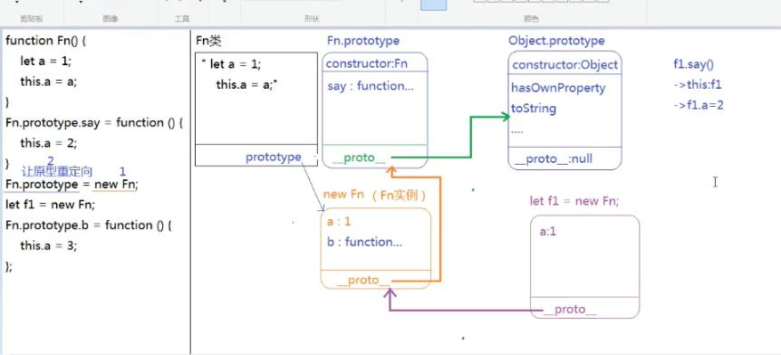
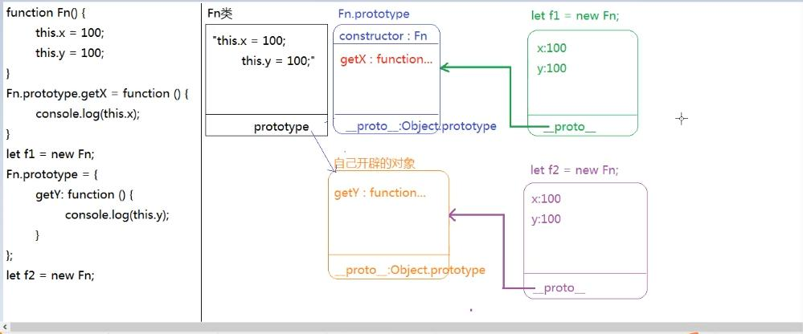

## 面向对象之原型和原型链模式(prototype && __proto__)
```
function Person(name,age){
	this.name = name;
	this.age = age;
	this.say = function(){
		console.log(this.name);
	}
}
let p1 = new Person('zhangsan',18);
let p2 = new Person('lisi',28);
```

>> 问题
通过new Person这个类，可以通过在函数体中this.xxx = xxx的方法来设置每一个类私有的属性和方法，也就是构造出来的实例对象p1和p2中的属性和方法都是私有的，那么如何为每次构造出来的实例添加公共的属性和方法呢？

>> 答案
基础概念：所属实例原型链上的prototype中定义的属性和方法都会被当作公用的属性和方法而添加到当前实例对象上。

实现方案：将公共属性和方法定义在类的prototype原型对象上即可

## 原型及原型链
```
function Person(name,age){
	this.name = name;
	this.age = age;
	this.say = function(){
		console.log(this.name);
	}
}
Person.prototype.eat = function(){console.log(this.name);}
Person.prototype.say = function(){console.log(this.name);}
let p1 = new Person('zhangsan',18);

```

### 1.函数(类)的内置属性prototype(原型对象)
>>> 核心：每一个函数数据类型的值，都有一个天生自带的属性：prototype(原型对象)，这个属性的属性值是一个对象，用来存储当前类公用的属性和方法。

JS中数据类型为函数'function'的有：
1.函数声明和函数表达式创建的普通函数
2.类也是函数，一个函数通过new执行之后可以称之为类。
  类分为自定义类和内置类
  自定义类：开发者自己通过new一个构造函数，这个构造函数就变成了自定义类
  内置类：JS这门语言内置的底层类，比如Number，Array，Object，Date等等


因为函数在JS中也是对象，对象就有属性和方法。
每一个JS中声明的函数都是Function这个类的实例，每一个函数实例都有的属性和方法有：
arguments：代表函数在执行时被传入的实参列表集合，是一个类数组
caller：指向函数名自身，如果是匿名函数则为null
length：函数声明或者定义时的形参个数
name：函数名
prototype：原型对象，该对象中存储着Function这个类公有的属性和方法
__proto__:原型，数据类型还是一个函数。函数又是对象，对象里面又由若干对键值对构成，函数的call apply bind toString等方法都封装在原型中。

### 2.原型对象的内置属性constructor(构造函数)
>>> 核心:在每一个类的prototype这个对象中有一个天生自带的属性:constructor(构造函数),这个属性constructor的属性值存储的是当前类本身。
Person.prototype.constructor === Person;  true
Person.constructor ===  Function; true  指向内置类Function构造函数

### 3.实例的内置属性__proto__(对象的原型)

>>> 核心：每一个对象数据类型的值，都有一个天生自带的属性：__proto__,这个属性指向“所属类的原型对象prototype”。
看一个对象数据类型的值，先看它是由哪一个类构造出来的，那么这个对象实例的__proto__属性就指向构造它的那个类的prototype属性。

p1.__proto__ === Person.prototype; true+
p1是自定义类Person的实例，所以它的__proto__指向Person.prototype 


Person.__proto__ === Function.prototype; true
Person作为一个函数（类）,它是Function这个类的实例，所以他的__proto__指向Function.prototype 

Person.prototype.__proto__ === Obejct.prototype true
Person.prototype是Object这个类的实例，所以它的__proto__指向Obejct.prototype 

JS中数据类型为对象'object'的有：
1.普通对象
2.数组对象
3.正则对象
4.日期对象
5.数学函数对象
6.类数组对象
>> 7.通过new操作符构造出来的实例对象
>> 8.函数的原型prototype的值也是对象
>> 9.函数本身也是对象


## 若干问题
### Object.prototype原型链终端
f1和f2都是由自定义类Fn构造出来的对象实例，所以f1.__proto__ = Fn.prototype
但是Fn.prototype也是一个对象，是对象就有__proto__属性，那么Fn.prototype这个对象又是哪一个类的实例呢？

凡是在JS中浏览器自带的对象，不是我们手动创建出来的类，都是由Object这个内置的基类(函数)创建出来的，所以Fn.prototype.__proto__ === Object.prototype

### Object.prototype原型对象上都有哪些需要我们学习的？
同理：Object.prototype的值也是一个对象，改对象中存储了Object这个类公共的属性和方法。
constructor；指向Object
toString：多用于数据检测,返回字符串类型的'[object Object]'
hasOwnProperty：检测某个类的实例上的某个属性是否是自身的而不是来子原型对象上的

### Object.prototype.__proto__ = null的底层原理？为什么不是undefiend？
Object.prototype.__proto__ = null；
因为Object.prototype这个对象也可以看作是由内置类Object构造出来的，但是由于Object这个类是JS最底层的类，所以Object原型对象的__proto__属性最终指向null


(这里也可以看作一个null和undefined的区别)
因为Object.prototype.__proto__也就是Object.prototype对象上并没有__proto__这个属性，所以值应该为undefiend；但是这里由于Object是所有对象数据类型值的最底层类，按照规律来说Object.prototype.__proto__应该是指向Object.prototype，没有任何的意义,所以默认赋值为null，也就是说这个值有，但是值是null


## 原型链查找机制
>>> 步骤：
1.先找自己私有的属性方法，有则调取，没有则继续查找
2.基于__proto__属性查找当前实例所属类的原型上的属性和方法(Fn.prototype)
3.如果还没有则基于__proto__属性向上依次查找，直到查找到原型链的终端Object.prototype为止
4.如果还是没有找到，那么就返回undefined

这种基于对象的__proto__属性一层一层向上查找属性的机制，叫做原型链的查找机制

>>> 举例：
f1.__proto__ ====> Fn.prototype;
Fn.prototype.__proto__ ===> Object.prototype;(原型链查找到此为止)
Object.prototype.__proto__ = null;

f1.say === Fn.prototype.say  false 因为自己私有的方法say已经存在
f1.__proto__.say === Fn.prototype.say true 基于原型链查找机制，都指向Fn函数的原型对象上的say

>>> f1是Object这个类的实例？这句话正确么？
正确。因为f1实例也继承了Object这个类的prototype原型对象上公有的属性和方法，比如f1.toString()也可以被调用，而toString方法是定义在Object.prototype上的，所以可以证明f1确实是继承了Object.prototype上的方法，所以f1也是Object这个类的实例。

>>> 只要一个值是对象都是Object这个类的实例。

如何用JS中方法验证呢？
f1 instanceof Object  true 说明f1确实是Object这个类的实例
f1 instanceof Fn  true 说明f1是Fn这个类的实例

>>> 只要在实例的原型链上可以找到这个类，那么就返回true，不仅仅是局限于构造这个实例的那个类。

## 基于内置类来理解原型和原型链

var arr1 = [1,2,3];
var arr2 = [4,5,6];

>>> arr1.push(10);这个语句执行底层的进行了那些操作？
1.arr1这个实例是由Array这个内置类构造出来的
2.所以arr1.push()代表基于原型链的查找机制找到当前实例所属类Array.prototype原型对象上的push方法，并且把push方法执行。
3.push方法执行的结果就是在arr1的末尾添加一个元素10，并且返回添加后的数组长度。

>>> arr1.hasOwnProperty(demo);这个语句执行底层进行了那些操作？
1.arr1这个实例是由Array这个内置类构造出来的
2.基于原型链查找机制找到hasOwnProperty这个属性是存在于Object.prototype原型对象上的方法，并且将这个方法执行
3.执行的结果就是检测demo这个属性是否属于当前实例arr1，如果是返回true，如果不是返回false

>>> 为什么getElementById('demo')这个方法的上下文只能是document？而不能是其他元素对象？
本质就是基于原型链查找机制验证两个问题：
1.document这个实例的原型或原型链上是否有getElementById这个方法
2.普通元素对象实例的原型或原型链上是否没有getElementById这个方法

如果1成立并且2成立，那么就代表这个方法只有document实例的原型链上才有，所以只能被document这个实例调用。

>>> 一、依次查找document实例的原型链

1.document.__proto__ ===> HTMLDocument.prototype
2.HTMLDocument.prototype.__proto__ ===>Document.prototype

Document.prototype对象上有我们常用的操作DOM的方法，比如：
+ getElementById 存在于Document.prototype原型对象中
+ createElement
+ querySelector ...

3.Document.prototype.__proto__ = Node.prototype
Node.prototype对象上定义一系列属性和方法，比如节点类型的值：
+ 元素节点 1
+ 属性节点 2
+ 文本节点 3
+ 注释节点 8
+ 文档节点 9
或者一些常用的操作节点的方法：
+ firstChild
+ cloneNode
+ insertBefor
+ appendChild ...

4.Node.prototype.__proto__ = EventTarget.prototype
EventTarget.prototype原型对象上定义了一些方法，比如：
+ addEventListener
+ removeEventListener

5.EventTarget.prototype.__proto__ = Object.prototype

>>> 二、依次查找div对象实例的原型链
1.div.__proto__ = HTMLDivElement.prototype
2.HTMLDivElement.prototype.__proto__ = HTMLElement.prototype
3.HTMLElement.prototype.__proto__ = Element.prototype

Element.prototype上有一些我们常见的方法：
+ getElementByClassName
+ getElementByTagName
+ ...
但是没有找到getElementById这个方法

>>> 这也就解释了为什么getElementById这个方法的执行上下文只能是document，因为根据原型链查找机制，只有document这个实例的原型链上有getElementById这个方法；而其他元素对象的原型链上并没有该方法。

4.Element.prototype.__proto__ = Node.prototype
后续就和document一样，依次查找EventTarget.prototype，最后到达Object.prototype


## hasOwnProperty方法和in操作符的区别
#### 1.hasOwnProperty方法
obj.hasOwnProperty([propertyName])
作用：用于检测一个属性propertyName是不是对象obj的私有属性
返回值：
如果是那么返回true，
如果这个属性来自于对象obj的原型或原型链，那么返回false

#### 2.in操作符
[propertyName] in obj

作用：用于检测一个既有属性propertyName是否属于对象obj，不管是obj自己私有的属性还是来自obj原型或原型链上的公有属性。

返回值：都是布尔值true或者false

注意点：
1.对象obj可以是普通对象{}，或者数组[]，还可以是基本数据类型的包装类new String()等基本值包装类对象

2.检测的属性值propertyName可以是一个属性名，或者是一个数字索引

3.如果是属性名，必须用字符串包裹后检测；如果是数字索引或者数字的属性名，可以不用字符串包裹

字符串和数组对象：数字索引和length属性可以不加引号，但是其该实例原型和原型链上的属性和方法必须加引号

var str = new String('123');
var arr = [1,2,3];
0 in str       true 此处0可以不加引号
length in str  true 此处length也可以不加引号

普通对象：数字类型的属性可以不加引号，其他属性名必须加引号才可以
var obj = {
	bb:111,
	cc:333,
	0:456
}
console.log(0 in obj); true 此时数字属性0可以不加引号
console.log('bb' in obj); true 此处属性bb必须加引号才可以

#### 3.如何判断一个属性是对象的公有属性还是私有属性？
存储在某个对象堆内存中的属性就是私有属性，基于原型链查找的属性就是公有属性。
__proto__在IE浏览器中被保护起来了，在IE10及IE10以下,访问该属性的结果是undefiend

#### 4.例题
>>> 私有属性还是公有属性，是相对那个实例调用hasOwnProperty方法来判断的。
Array.prototype.hasOwnProperty('hasOwnProperty')
判断hasOwnProperty这个属性是否是Array.prototype这个对象的私有属性，返回false

Object.prototype.hasOwnProperty('hasOwnProperty')
判断hasOwnProperty这个属性是否是Object.prototype这个对象的私有属性，返回true

#### 5.基于Object类的原型封装一个方法hasPublicProperty，要求可以检测某个属性是否为对象的公有属性

>>> 老师的方法一：利用&&逻辑与短路运算符返回
学习的点：
1.验证一个参数是否为数字字符串及布尔值的合法性 includes方法
2.A条件成立的前提下，再判断B条件是否成立，并且B条件的判断结果将作为整个表达式的结果
用了 A && B 逻辑与运算符
如果A成立，那么看B条件是否成立；B条件成立的话表达式结果为true；不成立的话结果为false
如果A不成立，那么直接返回false，不进行后续判断

```
Object.prototype.hasPublicProperty = function(prop){
	// 1.首先验证传入参数prop的合法性：传入的参数必须为数字字符串及布尔值基本数据类型值
	if(!['number','string','boolean'].includes(typeof prop))
	return false;
	
	// 2.参数合法，开始检测对象中是否有这个属性prop
	// 3. 检测这个属性prop是否为私有属性
	let n = prop in this,
	    m = this.hasOwnProperty(prop);
	
	// 4.将判断后的结果返回
	return n && !m;
}
var arr = [1,2];
console.log(arr.hasPublicProperty('concat')); true
console.log(Array.prototype.hasPublicProperty('concat')); false

```

>>>我自己封装的方法二：利用连续三元运算符返回结果
```
Object.prototype.hasPublicProperty = function(prop){
	// 1.首先验证传入参数prop的合法性：传入的参数必须为数字字符串及布尔值基本数据类型值
	if(!['number','string','boolean'].includes(typeof prop))
	return false;
	
	// 2.参数合法，开始检测对象中是否有这个属性prop
	// 3. 检测这个属性prop是否为私有属性
	);
	let result = prop in this? this.hasOwnProperty(prop)?false:true:false;
	// 4.将判断后的结果返回
	return result;
}
```

## 面向对象及原型链中的this问题

查找前提：
1.只有当方法执行的时候方法中的this指向才会被确定，不执行的时候函数体及this本质上是存储在堆内存中的代码字符串。
2.构造函数执行的时候，函数体内的this指向当前类的实例对象。
3.普通函数中的this指向调用当前方法的对象

>>>面向对象中有关私有/公有方法中的this问题，按照以下三步进行查找：
私有/公有方法中this查找规则：(注意是方法中this，也就是定义在对象上的方法)

1.当方法执行的时候，看方法前是否有点，点前面是谁this就是谁
2.将函数体中的所有this都进行替换
3.最后再根据原型链查找机制确定结果即可

举例分析：
p1.say(); say方法执行时的this是p1，p1.name = 'zhangsan'
p1.eat();eat方法执行时的this是p1，p1.age + p1.name = 'zhangsan18'

p1.__proto__.say();say方法执行时的this是p1.__proto__,也就是p1.__proto__.age输出undefined
Person.prototype.eat();eat方法执行时的this是Person.prototype，也就是Person.prototype.age + Person.prototype.name；返回结果为NaN


```
function Person(name,age){
	this.name = name;
	this.age = age;
	this.say = function(){
		console.log(this.name);
	}
}
Person.prototype.eat = function(){console.log(this.age + this.name);}
Person.prototype.say = function(){console.log(this.age);}

let p1 = new Person('zhangsan',18);


```


## 基于内置类原型拓展方法的几个注意点
>> 1.为什么要在内置类的原型上拓展我们自定义的方法？
在内置类原型上的方法，内置类所创建的实例可以直接调用，比如实例.方法();arr.push()
如果我们也把自己写的方法放到原型上，那么当前类的实例也可以直接通过.方法调用我们写的自定义方法，而不再需要将实例通过参数传入之后调用。
还有就是基于内置类拓展的方法如果返回值是当前类的一个实例，那么方便后续的链式编程

>> 2.举例 两种数组去重方法的对比 

+ 之前封装的数组去重方法：
```
function unique(arr){
	var obj = {};
	for(var i=0;i<arr.length;i++){
		var item = arr[i];
		if(obj[item]!== undefined){
			arr[i] = arr[arr.length-1];
			arr.splice(arr.length-1);
			i--;
			continue;
		}
		obj[item]=item;
	}
	obj = null; //obj在使用之后指向null，防止内存泄漏
	return arr;
}
```
调用方法：let newArr = unique(arr);newArr就是去重后的数组

+ 基于内置类原型拓展方法并且基于链式写法：
1.自己拓展的方法名不要和原有内置的方法名重复,可以将自己拓展的方法加一个前缀my
2.自己拓展的方法中的this一般都是当前类的实例,也就是方法需要操作的值
3.自己拓展的方法的返回值还是this,是为了保证执行完此方法之后返回的结果依然是当前类的一个实例,该实例就可以继续调用当前类的其他方法进行操作,这种编程方式就是链式编程。
arr.myUnique().sort((a,b)=>a-b).reverse().slice(2).push(); 链式调用
链式写法的核心：保证每次方法执行之后返回的值都是一个当前类的实例
```
~function(){
	/*
	* myUnique:基于原型实现数组去重
	*   @params  无	
	*   @return  [Array] 去重后的数组
	*		
	* by GaoKai on 2021/04/18	
	*/
	Array.prototype.myUnique = function(){
		let obj = {};
		let that = this;
		for(var i=0;i<that.length;i++){
			var item = that[i];
			if(obj[item] !== undefined){
				that[i] = that[that.length-1];
				that.splice(that.length-1);
				i--;
				continue;
			}
			obj[item] = item;
		}
		obj = null;
		return that;
	}
}();
var arr = [1,2,2,4,5,4,3,45,4,5,3];
arr.myUnique();
console.log(arr)  [1, 2, 3, 4, 5, 45]

```

## 如何判断某一个值是不是数组？
Object.prototype.toString.call(value) === '[object Array]';

>>> 基于construcotr检测数据类型的原理
arr.constructor === > Array
基于原型链__proto__ 查找：
arr.__proto__.constructor ===>  Array.prototype.constructor = Array

弊端：
如果用户定义了一个私有的constructor属性，那么检测会失效
如果用户重写了当前实例所属类的原型对象prototype中的constructor方法，那么检测也会失效
## 类的原型重定向及注意事项
>>>1.什么是类的原型重定向？
类的原型重定向的意思不是在类的原型对象上添加属性或方法，而是让某个类的原型对象指向新的堆内存地址。实际项目中把这个操作叫做重构类的原型

比如f1实例的类是Fn,那么默认的f1.__proto__ = Fn.prototype;
此时如果我们将Fn.prototype = {}指向一个新的堆内存地址，那么Fn.prototype类的原型和原来的联系都会被切断，这种操作就是重构类的原型。


>>>2.批量给原型设置属性方法的时候，有几种常用方法
1.给类的原型设置别名 let proto = Fn.prototype
2.将类的原型重定向，重构类的原型
Fn.prototype = {
 A:...，
 B：...，
}

>>> 3.类的原型被重构之后的弊端及注意事项
注意点：
1.当类的原型被重定向之后，原本类的原型所占的堆内存空间会被浏览器的垃圾回收机制所回收
2.内置类的原型担心通过重定向的方法将内置类的方法都消失，所以内置类的原型对象不可被重构
不能重构:Array.prototype = {}  不会被重构
但可添加;Array.prototype.myfun = {}; 可以添加或者重写方法

弊端：(手动将constructor属性指回 克隆原有方法和属性)
1.原本类的原型对象上的constructor属性会丢失，这样会导致类和原型的机制不完整。正确的做法是将类的原型重构之后将constructor属性手动指向改写后的原型对象。

2：如果在一开始未重构类的原型之前就给当前类的原型上添加了某些属性和方法，那么重构后这些属性和方法都会丢失、所以我们需要保证在重构前原有原型对象中没有属性和方法，如果有的话需要克隆到新的原型对象中。

## 关于类的原型重定向的一道经典面试题
题目：
```javascript
function Fn(){
	let a = 1;
	this.a = a;
}
Fn.prototype.say = function(){
	this.a = 2;
}
Fn.prototype = new Fn; //这种，代表指向的是Fn类的实例，所以它的__proto__属性还是指向原有内置的Fn.prototype
/*
如果是这种，那就代表重定向后的Fn.prototype指向的是一个Object类的实例，所以它的__proto__属性直接指向Object.prototype
Fn.prototype = {
	xxx；xxx,
	yyy:yyy
};
*/

let f1 = new Fn;
Fn.prototype.b = function(){
	this.a = 3;
};

console.log(f1.a);
console.log(f1.prototype);
console.log(f1.b);
console.log(f1.hasOwnProperty('b'));
console.log('b' in f1);
console.log(f1.constructor == Fn);
```

解析图：


总结注意点：
Fn.prototype = new Fn;
这句代码是易错点，也是混淆点，分为两步去看待。

1.先执行new Fn，执行的过程中首先由类Fn构造出一个类的实例，假设就叫fn,那么这个fn也是一个对象，是对象就有内置属性__proto__以及私有属性a：1。注意此时的__proto__指向的是重构前的类的原型。

2.再执行赋值操作，将fn对象的内存地址赋值给当前类的原型，完成原型的重定向，此时类的原型已经从内置的原型对象指向了重构后的原型对象，也就是fn对象。

3.但是在这些操作之后，*原本类的原型对象并不会因为重定向而被回收*，这是因为fn对象中的__proto__始终指向原来的原型对象，要注意重定向的是Fn.prototype；而不是fn.__proto__。

最终f1原型链应该为：
f1.__proto__ === > Fn.prototype(也就是fn)
(重构后)Fn.prototype.__proto__ = fn.__proto__(指向最初的原型对象)
fn.__proto__ = Fn.prototype(重构前)
Fn.prototype.__proto__ = Obejct.prototype

要比以往分析的重定向原型的题目多一个链接关系。具体看图。

## 原型重定向之后通过类创建的实例的__proto__会指向不同的原型对象


## 基于原型链编程题，实现下列方法
let n = 10;
let m = n.plus(10).minus(5);
console.log(m); => 15 (10+10-5)

```
1.立即执行函数包裹，防止全局变量冲突
2.先分开封装小函数，实现功能
3.将封装好的方法添加到内置类的原型上
4.this = this + value;
  this不可以给this赋值，可以改变指向，但是不可以手动赋值
5.链式调用的前提是函数返回的一定是同一个类的实例

~function(){
	function checkNumber(n){
		n = Number(n);
		return isNaN(n)? 0:n
	}
	
	function plus(x){
		x = checkNumber(x);
		return this + x;
	}
	
	function minus(y){
		y = checkNumber(y);
		return this - y;
	}
	
	Number.prototype.plus = plus;
	Number.prototype.minus = minus;
}();

```


