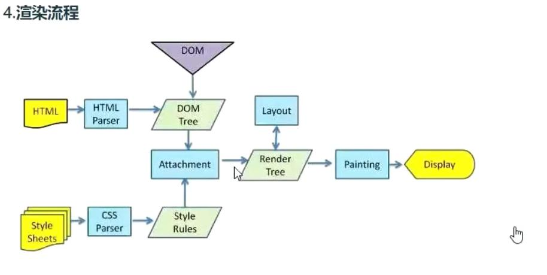

## 本月主要内容为浏览器和网络以及性能优化三块内容的学习
从输入url到浏览器页面渲染完成知识链
前端性能优化到底是在优化什么
在优化的过程中关于HTTP网络又有哪些前端必须要掌握的
性能优化浏览器的监控手段
谷歌Devtools的使用
前端安全
姜文还有一门网络的课程

## 浏览器渲染原理与全链路性能优化2天 ———— 姜文

## 一、浏览器的进程与线程
计算机中的进程指的是操作系统所分配的基本单位，进程中包含线程，代码是运行在线程里面的。

浏览器是由多个进程组成的，这是为了浏览器的稳定性和安全性考虑的。

### 浏览器的多进程架构如何组成
1. 浏览器进程：页面显示 用户交互 管理子进程 提供存储等
2. 插件进程：chrome中安装的插件
3. 渲染进程：每一个tab页卡中都有一个渲染进程
4. 网络进程：处理网络资源加载html css和js等
5. GPU进程：3d绘制，硬件加速提高体验

进程间的通信 RPC

## 【浏览器宏观请求】从输入url到页面展示
浏览器进程：输入的是合法URL还是说搜索关键字，前者直接开始导航，后者默认的搜索引擎将会根据关键字生成URL
浏览器进程：准备一个渲染进程用于渲染页面
网络进程：加载服务器返回的网络资源，并将资源提交给渲染进程来进行处理（子进程间通信IPC）
渲染进程：渲染页面，页面展示给用户

> 子进程间通信方式
postMessage
web worker
## 【微观细节】从输入url到页面展示

### 网络七层模型(四层)
> 一般将以下两层统一称之为物理层,网线电缆等
物理层
数据层

网络层：IP协议
传输层：TCP/UDP协议

> 一般将以下三层统一称之为应用层 应用层的主要协议是HTTP协议
会话层
表示层
应用层

### 查找缓存（多个地方的缓存）
浏览器的缓存策略
检测缓存是否过期，过期才去请求，没有过期直接返回缓存中内容
内存缓存或者磁盘缓存

### 看域名是否被解析过，DNS协议
DNS 将域名协议为IP地址 + 端口号
DNS是一个分布式的数据库，主要是将域名好IP地址做了一个映射而已
DNS的解析是基于UDP协议的，为什么不采用TCP呢？因为基于域名解析IP地址是一个迭代查询的过程（一级域名二级域名三级域名），如果是TCP协议每次去域名服务器查询的时候都要三次握手建立连接太浪费时间；但是UDP不需要三次握手

### TCP和UDP的区别：
TCP：安全可靠，分包传输，丢包的话可以重新传输
UDP：传输速度快，但是有丢包风险

### 如果请求是HTTPS协议 进行SSL协商 保证数据的安全可靠
HTTPS的对称加密
HTTPS的非对称加密

### 基于IP地址来进行寻址，排队等待
同一域名在HTTP1.1协议下最多可以同时发起6-8个请求
当同一时间需要发送的请求超出6个的时候，就需要排队

### tcp创建连接 进行三次握手
为什么是三次不是2次
怎样进行3次的
wireshark进行抓包

### 利用tcp传输数据 将数据拆分成数据包
可靠
有序
发送的时候会拆分成数据包
服务器会按照顺序来接收

### http请求
请求行
请求头
请求体

http请求默认不会断开tcp链接，keep-alive 为了下次传输数据的时候 复用上次创建的tcp链接通道

### 服务器收到数据后
响应行
响应头
响应体

### 状态码
301和302会进行重定向，至此又会重新走一遍以上的流程
304 代表查询浏览器缓存进行返回

### 基于谷歌控制台查看HTTP请求的一个过程

地址栏输入jd.com，任意选中一个请求查看浏览器控制台NETWORK中相关信息：
Timing表示该请求的时间线轴线：

1. Quened at 36.01ms 
代表发送请求前的排队所消耗时间为36.01ms
有可能是前面有正在发送的请求
有可能是有的请求优先级比较高所以排队（network中有Priority选项代表请求的优先级）

Started at 36.01ms
正式开启请求时间

2. Connection Start 开始连接
	Stalled     tcp链接复用 处理代理相关的逻辑所等待的时间
	DNS Lookup  DNS域名解析消耗的时间
	Initial connection 创建TCP连接所消耗的时间
	SSL 如何是HTTPS请求进行SSL协商消耗的时间

3. Request/Response 请求响应阶段
	Request sent 发送请求的时间 很短 没法优化
	Waiting（TTFB）从发起请求到服务器返回首字节时间（可优化点：请求发出到响应总时长）
	Content Download 服务器返回的资源下载所需时间（可优化点：返回资源的大小会影响时间）
	

### HTTP发展过程
很多网站的静态资源现在都用HTTP/2来进行传输


1. http0.9 
负责传输html 
没有请求头和响应头
只能处理纯文本信息，图片不可处理

2. http1.0
增加了http的header
根据header的不同来处理不同的资源
每次发完请求都会断开tcp链接

3. http1.1
默认开启keep-alive长连接 在一个tcp连接通道上传输多个http请求 链接复用
管线化  一个域名可以同时建立6个tcp链接
(一个tcp通道可以不断开一直发请求 而且http1.1还支持了同时建立6个tcp协议请求)
服务器处理多个请求是按照顺序来返回的，并发是一次发的，但是响应是按照顺序一个个来进行响应的，引发队头阻塞问题

4. http2.0
http2.0是必须要基于https的
用同一个tcp链接来发发送数据 一个域名一个tcp
把多个请求按照二进制分帧层实现了分帧 一个tcp链接直接搞定 解决了队头阻塞问题 多路复用
多个请求复用同一个tcp通道

头部压缩：http2.0的请求头字段有的是以冒号开头的，主要是做一个映射表，基于xpack压缩技术将请求header进行压缩，
之前只有客户端可以向服务器主动发消息，http2.0则可以让服务器主动给客户端发消息

5. http3.0
tcp就是会有丢包阻塞重发的问题
解决了tcp的队头阻塞问题
http3.0直接不用tcp了，用udp协议 创建了一个QUIC协议，这个协议是在传输层的上一层
了解一下

### 用http1.1和2.0发相同请求的对比
1. http1.1
请求thml文件
拿到html文件
协议html文件，发现link和script标签
接着同时请求css和js文件
用了两个tcp链接通道

2. http2.0
用了一个tcp链接，一条线
时间要比用http1.1快
请求html文件
返回html文件的同时将该文件所需的js和css静态文件提前以二进制流文件stream的方式主动推送给客户端
客户端拿到html文件
客户端的http缓存中将服务端推送的css和js文件进行缓存
客户端解析html文件，遇到css和js文件
直接去http缓存中拿到资源进行加载，减少了请求的流程，所以速度快

对比可发现：同样的文件h2协议传输要比http1.1传输的资源文件包小

3. 浏览器network中时间轴上的两条线：
蓝色的线代表DOMContentLoaded：516ms 也就是DOM加载完成的时间
砖红色的线代表Load：637ms 也就是所有静态资源加载完成的时间


### 浏览器的渲染解析流程



1. 解析HTML模板
因为浏览器并不能直接操作HTML，所以会将HTML标签解析成为AST语法解析，变成一个个节点之后挂载到DOM树上


浏览器在解析html\css和js的时候都是如何解析的？
+ 为什么要把css放在上面? 
如果把包含css样式表的link标签放置在最底部的时候，首先要确认一个前提就是浏览器在解析前面的标签的时候会边解析边渲染的，也就是说现在有一个div，浏览器会先给他一个默认的样式渲染出来，所以当最底部解析到link标签的css表的时候，这时候会另外开一个线程用于加载css，加载完成之后将css解析成为cssom，此时又会再次给div渲染一次样式，所以会造成浏览器的重绘现象。
放在下面的时候是局部渲染，渲染第一个div的时候并不依赖于底部的css样式，所以会先渲染一个默认样式的div，等异步加载的css样式ok之后再重新绘制一次有样式的div。

从performance的时间轴看的话，刚开始绘制了一次，等到css解析完成之后又会绘制一次。很清晰的可以看出来 必须给你截图必须打你脸！！！
重绘的很高，要重新计算样式，还有可能造成回流

但是把link放在head标签的时候，由于html渲染的时候会先扫描js和css，所以这种情况下渲染dom的时候会一定等待css加载完成之后，再去渲染出来。就好比如果样式再上方，那我渲染一个dom节点的时候，是必须要等待这个节点的css样式解析完毕，才可以进行渲染。放下面人家并不会等你。

必须放在head中，放在body的第一行也不会等待的


> 几个关键词
dom解析 html解析 抽象语法树AST 构建dom树
css解析 样式计算
合成LayerTree
渲染 必须合成渲染树之后才会渲染


核心主流程：浏览器在解析html的时候是一行一行从上到下解析的，其实是解析一个html标签就渲染对应的dom结构在页面上，不是说等到全部的标签解析完之后才一次性展示到页面上的。


遇到css样式表，不会阻塞html解析；但是css会阻塞页面的渲染

1. parseHTML 解析HTML形成dom树
2. parseStylesheet 解析cssom树
3. updateLayerTree 更新布局树
4. paint 渲染

浏览器控制台的performance用法

+ 为什么要把js放在下面

js会阻塞html的解析，一旦遇到下面这种script标签写在body内部的：
```html
<!DOCTYPE html>
<html lang="en">
	<head>
		<meta charset="utf-8">
		<title>浏览器渲染原理</title>
		<link rel="stylesheet" type="text/css" href="./index.css"/>
	</head>
	<body>
		<div>hello</div>
		<script type="text/javascript">
			let count = 0;
			for(let i = 0;i<10000000;i++){
				count += i;
			}
		</script>
		<div>world</div>
	</body>
</html>
```
首先html parse解析会在<div>hello</div>之后停止解析
接着在执行js代码的之前会等待css解析加载完成
因为js有可能会操作css样式
然后开始执行内部的js代码
执行完成之后再去接着html parse 也就是下面的<div>world</div>

刚开始渲染的hello
后开始渲染的world

为什么要放在底部：
1. 要阻塞html解析 也就是会阻塞dom渲染的时间 导致DCL事件触发的很晚 影响性能
最新版本浏览器其实已经不会等待样式解析完成之后再执行js代码了，而是先执行，执行完成之后继续html parse，然后计算样式，渲染页面，所以html解析是一定会阻塞的

2. 有操作dom的风险 引起重绘和回流


```js
<!DOCTYPE html>
<html lang="en">
	<head>
		<meta charset="utf-8">
		<title>浏览器渲染原理</title>
		<link rel="stylesheet" type="text/css" href="./index.css"/>
	</head>
	<body>
		<div>hello</div>
		<script src="./index.js" type="text/javascript" charset="utf-8"></script>
		<div>world</div>
	</body>
</html>
```
css和js是并行请求的