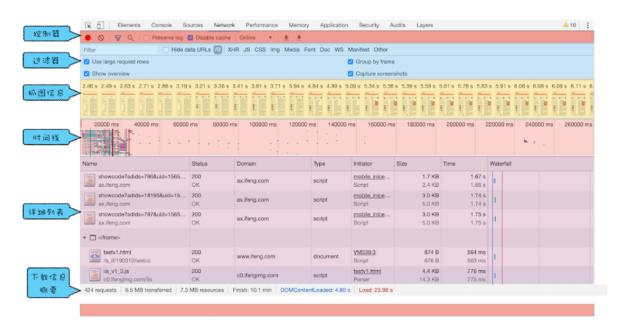
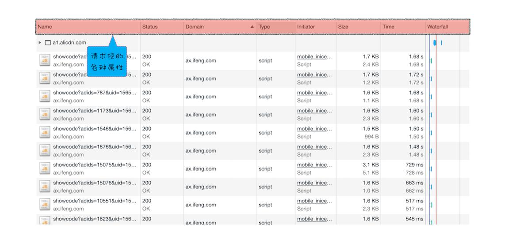
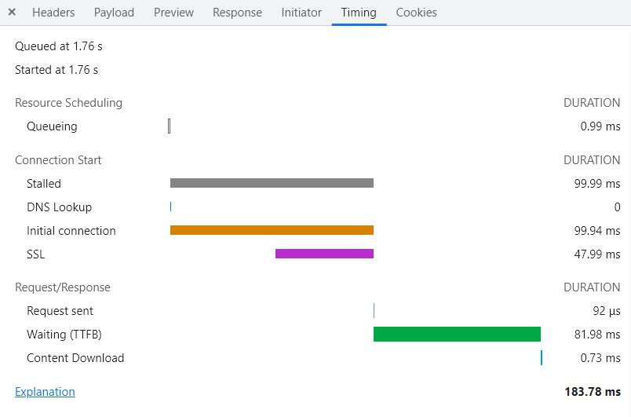

## Chrome开发者工具的10个面板
Chrome为我们提供了非常强大的调试工具DevTools，基于该工具我们可以对页面进行调试和性能分析，目前DevTools中包含了以下10个功能面板：
Elements：查看DOM结构，调试css样式
Console：调试js代码，可以和页面中的js对象进行交互
Sources：
+ 查看web应用加载的所有文件
+ 编辑CSS和js文件中内容
+ 将打乱的css或者js代码格式化
+ 支持js的断点调试
NetWork：查看网站所有网络请求和瀑布图信息
Performance：记录和查看web应用生命周期内的所有关键事件，分析影响页面性能
Memory：查看运行过程中js占用堆内存情况，追踪是否存在内存泄漏的情况
Security：显示当前页面的一些基础安全信息
Application：查看应用的本地数据存储，比如storage、cookie等
Audits：对当前网页进行网络利用情况、网页性能等各方面的诊断并给出一些建议
Layers：显示网页渲染过程中分层信息

## 分析页面的网络请求：NetWork网络面板

NetWork网络面板从上到下由6个模块组成，依次是：
1. 控制器：控制是否开始抓包、全局搜索加载的资源、模拟网络网速等功能
2. 过滤器：对网络请求到的资源按照种类进行一个过滤
3. 抓图器：展示了从页面开始到所有请求结束之后页面在不同时间点的屏幕截图
4. 时间线：通过拖动时间轴来查看在不同的时间间隔内有哪些请求发出哪些请求响应了。
+ 时间轴上的蓝色竖线，代表DOMContentLoaded事件触发，意味着用于构建DOM树的HTML、css以及js文件加载完成，DOM树已经生成。
+ 时间轴上的红色竖线，代表window的onload事件触发，意味着页面的其他资源比如图片、音频等全部加载完毕。
+ 时间轴上的多条竖线堆叠在一起，代表这些资源是同时被加载的。

5. 请求详细列表：展示了每一个资源从请求到响应完成这中间所有过程，以及最终请求到的数据信息，这是NetWork面板最核心的功能，后续要详细介绍。

6. 下载信息概要：当前页面的一些请求数据和概要
+ 发出的总请求个数 Requests：110
+ 传输了多少数据 Transferred：70kb
+ 所少资源被加载了 Resources：7.5MB
+ DOM树构建完成 DOMContentLoaded：200ms
+ 所有页面资源加载完成 Load：1.2s

## 详细请求列表的属性

我们可以基于这些常见的列表属性对所有请求有一个更加直观和清晰的分类，可以基于这些属性来对所有请求进行排序，默认情况下是按照请求发起的时间依次排序的，我们还可以基于请求的资源大小、请求类型、响应状态码等属性对资源进行排序，常见的请求属性如下：
+ Name 请求的资源名称/接口名称
+ Method 请求方法
+ Path 请求的资源路径
+ Url 请求URL
+ Priority 请求资源的优先级
+ Scheme HTTPS/Http
+ Protocol 协议版本http1.1 / http2
+ Status 响应状态码
+ Type 请求资源的MIME类型
+ Size 请求资源的大小
+ Time 请求所需的事件
+ Waterfall 瀑布图，鼠标hover上去可查看每一个http请求详细的时间消耗情况，通过瀑布图可以看出哪些请求是并行发起的，哪些请求是在DOM构建之前或者Load加载之后。

## Timing：单个资源的请求时间线
我们知道一个完整的HTTP请求和响应会经过以下几个阶段：
+ 浏览器构建请求行
+ 查找浏览器本地缓存，有则直接返回；没有进行下一步
+ DNS解析获取IP地址，并且获取端口号
+ 等待TCP队列
+ 建立TCP连接
+ 浏览器将请求报文发送给服务端
+ 服务端解析报文，准备响应数据
+ 服务端返回数据给浏览器
+ 浏览器解析响应行，如果有重定向那么发起新的请求；否则接收响应数据
+ 断开TCP连接

那么，以上这么多步骤我们该如何借助于网络面板来查看呢？答案就是每一个请求除了可以查看Headers、Response这些请求报文和响应报文之外，还有一个Timing选项可以查看这个HTTP请求从发起到返回响应的全流程，基于Timing选项提供的各项信息，我们可以分析HTTP请求的性能和优化点。

### 1. Resources Scheduling 排队阶段Queueing
当浏览器发起一个请求的时候，会有很多种因素导致该请求不能被立即发起，而是需要排队等待，具体的因素有以下几个：

+ 请求资源的优先级
在前面说过的请求详情列表属性中，有一个HTTP/2才有的属性Priority(优先级)表示每一个请求的优先级，从高到底依次是Highest、High、Low级别，一般来说页面的HTML、CSS以及Js这些资源是核心文件，优先级最高；而图片音频视频这些资源的优先级就相对较低，所以当两个优先级不同的请求同时发起的时候，优先级低的就需要给优先级高的让路。

+ 一个域名最多维护6个tcp连接，如果发起请求的时候这6个tcp队列都处于忙碌状态，那么就需要等待tcp队列。

### 2. Connection tcp连接阶段
在排队等待结束之后，就进入了发起连接的阶段了，这个阶段主要有以下几个子阶段：

+ Stalled 停滞
在发起tcp连接之前，有的时候还会有一些原因导致连接被推迟，具体就体现在Stalled上

+ DNS Lookup
DNS域名解析阶段，基于域名解析出来服务器的IP地址用于TCP连接

+ Proxy Negotiation 代理协商
如果在客户端到服务端有代理服务器的话，还会有一个代理协商阶段，用于和代理服务器连接协商消耗一定的时间。

+ Initial connection 初始化连接阶段
这个阶段就是客户端和服务器进行tcp连接所消耗的时间

+ SSL SSL协商
如果使用了HTTPS，那么还需要一个SSL握手时间，用于协商加密信息等。

### 3. Request/Response 请求响应阶段
在上面的tcp连接确认之后，就进入了正式的发送数据和响应请求阶段。

+ Request sent 发送请求
这个阶段主要就是浏览器将请求报文数据发送给服务器的时间，这个时间非常短，几乎没有可以优化的空间，通常连1ms都不到。

+ Waiting(TTFB) 第一字节时间
这个阶段就是从请求发出之后到接收到服务器返回的第一个字节数据所消耗的时间，TTFB是反映服务端响应的重要指标，这个事件越短代表响应越快。

+ Content Download 下载资源阶段
在客户端接收到第一字节到接收到服务端返回的全部资源所消耗的时间。

## 基于Timing分析网络请求优化点

### 1. Queueing排队时间过久
这个阶段的时间过长，一般来说都是客户端的问题。如果是HTTP1.1的话，大概率是1个域名同时只能维护6个tcp连接，但是同一时刻发起对于该域名的请求过多导致的排队时间过久。

+ 解决方法1：使用域名分片技术
把原来1个域名下的资源放在多个域名下，比如从原来的1个新增到3个，那么同时可以维护的tcp队列就是18个，大大增加了连接个数。

+ 解决方法2：升级到HTTP2
HTTP2不再有HTTP1.1中对于同一域名最大维护6个tcp连接的限制，具体原因会在HTTP2的专题中进行说明。

### 2. Waiting(TTFB) 第一字节时间过久

这个阶段的时间过长，一般来说有以下几个原因：
+ 服务端处理数据时间过久：如果没有缓存，建议服务端通过设置资源缓存的策略来优化
+ 网络环境不好：可以使用CDN来缓存一些静态资源文件，提高资源加载速度
+ 客户端在发起请求的时候请求头多余的信息比较多，服务端在解析请求头字段所消耗的时间长，比如不必要的Cookie信息。

### 3. Content Download 接收资源
这个阶段的时间过长，很有可能是服务端返回的资源过大导致的，这时候就可以使用压缩、减少源码中不必要的注释等方法减少资源的大小。