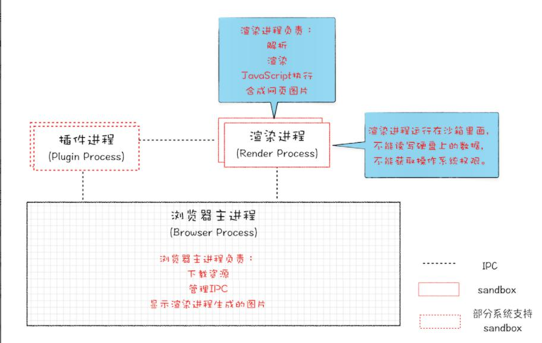
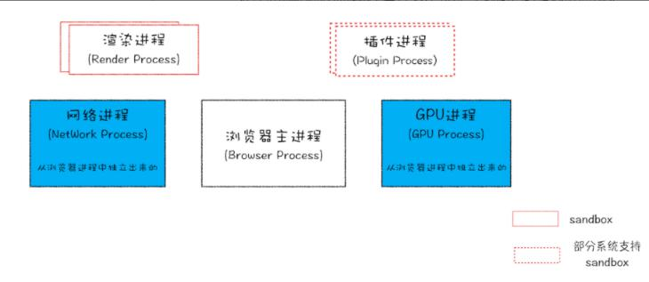

## 一、Chrome浏览器的任务管理器

### Chrome浏览器任务管理器打开方式
1. Chrome浏览器右上角选项 - 更多工具 - 任务管理器
2. 快捷键 Shift + Esc 打开任务管理器

### Chrome浏览器任务管理器的作用
基于Chrome浏览器的任务管理器，可以查看当前浏览器开启了那些进程，以及每一个进程的一些基本信息，比如：
+ 进程ID
+ 进程所占用的系统内存空间大小
+ 进程所消耗的CPU
+ 进程所消耗的网络带宽
+ 进程的优先级
+ 进程中javascripe使用的内容
+ ...


### Chrome打开一个页面需要开启哪些进程？

通过上述打开浏览器任务管理器的方式查看打开一个页面浏览器的进程，可以看到浏览器并不是只开启一个渲染进程的，而是开启了以下7个进程，其中有些进程是每一个页面都需要的，有些进程不是必须要开启的。

1. 浏览器主进程
2. GPU进程
3. 插件进程
4. 渲染进程
5. Network Service 网络进程
6. Storage Service 缓存进程
7. Audio Service 音频进程
8. 备用渲染程序
9. ...


## 二、浏览器中的线程与进程
在了解浏览器的进程和线程之间关系之前，先必须了解什么是并行处理。

### 单线程处理 VS 多线程并行处理
计算机中的并行处理指的是在同一时刻处理多个任务。
举例说明：比如我们要计算下面ABC的值并且最后进行显示
```js
let A = 1+5;
let B = 12/2;
let C = 2*3;
```
假设程序用单线程来进行处理,那么应该会分为4步处理：
1. 先计算A的值
2. 再计算B的值
3. 最后计算C的值
4. 然后将ABC的值分别显示出来

假设程序用多线程来进行处理，那么只需要分为2步处理：
1. 分配三个线程同时计算各自ABC的值
2. 将计算得到的ABC的值分别显示出来

> 结论：处理同样的任务，多线程要比单线程效率高，也就是并行处理能大大提升性能。

### 进程和线程的概念
> 进程的概念：
进程就是一个程序的运行实例。 用人话说就是每当计算机启动一个程序的时候，操作系统会为这个程序创建分配一块内存，这个内存的主要作用就是存放代码、保存程序运行时的数据、存放一个用于执行任务的主线程，我们把这样的一个大的运行环境叫做进程。

> 多线程并行处理的前提条件：
虽然多线程可以并行处理任务，但是有一个很重要的前提那就是线程是不能单独存在的，线程必须是由进程来进行启动和管理的。

线程依附于进程，但是进程中使用多线程来并行处理任务可以提升运算效率。

### 进程与线程的特点和关系

1. 进程中的任意一个线程出错，都会导致整个进程的崩溃，从而导致其他线程也出错

2. 线程之间可以共享进程中的数据，可以对进程中的公共数据进行读写操作

3. 当一个进程退出也就是销毁的时候，操作系统会回收该进程所占用的所有资源；即使其中任意一个线程因为操作不当导致内存泄漏，当进程退出的时候，这些内存也会被正确的回收。

4. 虽然线程之间可以共享用一进程中的数据，但是不同进程之间是互相严格隔离的，也就是每一个进程只能访问自己内存中的数据，从而避免系统进程间的互相干扰和紊乱，当前如果进程之间需要通信的时候，是可以基于IPC机制来进行通信。


## 三、单进程浏览器的架构


早在2007年之前，所有浏览器都是单进程架构，这也就意味着浏览器的所有功能模块都是运行在一个进程中的，这些模块包含了网络、插件、js运行环境、渲染引擎和标签页面。可想而知，这么多的模块运行在一个进程中，会导致浏览器的不稳定、不流畅和不安全。

### 问题一：不稳定
单进程浏览器不稳定的根本原因在于进程与线程的特点一，那就是一个进程中的任意一个线程出现问题，都会导致整个进程的奔溃。

早期浏览器的为了实现诸如web视频、web游戏等功能，都需要借助于浏览器的插件来实现，但是插件有个最大的问题就是不稳定容易出问题，而且浏览器的插件是运行在浏览器的进程中的，所以只要有一个插件意外出错都会导致整个浏览器的崩溃。

### 问题二：不流畅
在单进程浏览器架构中，它的进程主要由页面线程(最主要的)、网络线程以及其他线程三部分组成，而最核心的页面线程中则负责所有页面的页面渲染、页面呈现、javascript执行环境以及插件都运行在这个页面线程中，抛开上述的稳定先不谈，单就一个页面线程，也就意味着同一时刻以上那么多任务只要一个可以执行。

+ 某个页面执行了无限循环的脚本
比如A页面中在执行js代码的时候遇到了一个无限死循环的脚本，那么这就会导致其他页面的js脚本无法执行、页面无法渲染等所有模块都无法运行，从而导致浏览器逐渐失去响应变得卡顿不流畅。

+ 复杂页面的内存泄漏
除此之外，页面的内存泄漏也是单行程浏览器变慢的一个重要原因。浏览器在运行一个十分复杂的页面后关闭页面，会导致部分内存无法被完全回收，这样随着使用时间越长，内存占用越高，最后浏览器越来越卡。

### 问题三：不安全
+ 插件因素
插件可以使用C/C++进行编写，基于插件可以获取到操作系统的任意资源，意味着在浏览器中运行一个插件就可以完全操作你的电脑，比如某些恶意插件就基于这个原理释放病毒、窃取计算机中的账号密码等。

+ 页面脚本
某些页面脚本也可以基于浏览器的漏洞获取系统权限，从而进行一些恶意操作。


## 四、早期多进程浏览器的架构
.

### 早期多进程浏览器的架构组成
2008年Chrome发布时的多进程架构组成为：
+ 浏览器主进程
浏览器主进程主要负责下载网络资源、管理其他子进程IPC以及显示渲染进程中生成的图片

+ 渲染进程
渲染进程主要负责解析下载的网络资源、渲染页面、执行javaScript脚本以及合成网络图片

+ 插件进程
所有插件都单独运行在插件进程中

### 解决了那些问题
1. 稳定
由于不再是一个进程而是多个进程，基于关系3可知进程之间是互相隔离的，一个页面或者插件出错影响的知识当前那个页面的渲染进程或者插件进程，并不会影响到浏览器主进程或者其他页面的渲染进程，所以这就解决了页面或者插件运行崩溃导致整个浏览器崩溃的情况出现。

2. 流畅
一个页面的脚本出现无限循环，也仅仅阻塞的是该页面的渲染进程，其他页面和浏览器并不会受到影响，因为每一个标签页都有一个自己的渲染进程。

对于内存泄漏来说，多进程浏览器中的一个页面关闭意味着该页面的渲染进程被关闭了，基于关系2，一个进程被关闭之后该进程的所有内存都会被系统正确回收，哪怕是这个进程中的线程的某些不当操作造成了内存泄漏，所以关闭复杂页面带来内存泄漏的问题就解决了。

3. 安全
多进程浏览器中每一个页面的渲染进程是运行在安全沙箱里面的，也就是等于操作系统给进程加了一把锁，沙箱中的程序不能读写硬盘上的数据，也不能获取操作系统的权限，这就避免了安全的问题。


## 五、后来多进程浏览器的架构


### 多进程浏览器的架构组成
+ 1个浏览器主进程
子进程管理
浏览器操作界面展示
用户交互
提供浏览器本地存储等功能

+ 多个渲染进程(取决于打开了多少个标签页以及这些标签页是否为同一站点)
核心任务是将网络进程提交的HTML、CSS和js解析渲染为用户可以与之交互的网页
值得注意的是浏览器的排版引擎blink和js解析V8引擎都是运行在渲染进程中的，但是实现页面UI渲染和执行JS任务是互斥的，因为它们共用同一个线程
默认情况下浏览器会为每一个标签页都创建一个渲染进程
渲染进程为了安全考虑都是运行在安全沙箱中的

+ 1个GPU进程(从早期浏览器主进程中独立出来的)
早期是为了实现网页的3D CSS效果而独立出来的一个进程
后期用来绘制网页、Chrome自身的UI界面

+ 1个网络进程(从早期浏览器主进程中独立出来的)
主要负责页面的网络资源加载

+ 1个插件进程(取决于浏览器运行了多少个插件)
主要负责插件的运行，独立一个进程避免插件崩溃造成浏览器主进程的崩溃

+ 如果页面有iframe，那么iframe也会运行在单独的进程中

+ 如果浏览器安装了拓展，那么还有占用多个拓展进程

## 六、面向服务的多进程浏览器架构
2016年，Chrome官方使用“面向服务的架构思想”重新设计了浏览器的架构。
原来的各个模块被重构成一个个独立的服务Service,每个服务都可以在独立的进程中运行，访问服务必须使用定义好的接口，基于IPC来进行通信，从而构建出一个更加内聚、低耦合、易于维护和拓展的系统。

解释：原来多进程浏览器的架构，是每个页面都需要若干进程完成各自页面的工作，现在是将各个页面通用的功能（比如音频、视频、网络等）发布为浏览器底层的基础服务，不同的页面都可以基于定义好的接口来完成通信，从而可以让多个页面共用一些基础的服务。

比如：
+ Storage Service 缓存进程
从原来的浏览器主进程中分离出来的缓存服务，主要负责提供浏览器本地存储等功能
+ Audio Service 音频服务
+ Video Service 视频服务

## 七、问题
### 问题1：为什么就算是现在的Chrome多进程架构浏览器，也会出现单页面卡死最终导致所有页面都崩溃的情况呢？

> 同一站点的页面可以复用渲染进程
虽然浏览器默认情况下会为每一个页面都分配一个独有的渲染进程用于渲染页面，但是如果从一个页面打开了新页面，而新页面和当前页面属于同一站点的话，那么Chrome不会再为该页面打开一个一个新的渲染进程，而是直接复用父页面的渲染进程。


> 哪些网页可以称之为同一站点(same-site)？
网页的根域名和协议相同，那么根域名下的所有子域名和不同端口号都属于同一站点的网页。比如：
https://time.geekbang.org
https://www.geekbang.org
https://www.geekbang.org:8080

上面三个URL的协议都是https，并且根域名都是geekbang.org,符合同一站点的规范，所以以上三个站点会复用同一个渲染进程。在这种情况下，如果一个页面崩溃了会导致同一站点下的所有页面都崩溃，因为他们共用同一个渲染进程。

>为什么要让同一站点的网页共用同一个渲染进程呢？
这是因为在同一个进程中可以共享JS的执行环境，也就是A页面可以直接在B页面执行脚本，由于是同一家站点，所以有这个需求需要实现。

综上所述，对于在同一站点下的多个页面，他们公用一个渲染进程，这也就意味着公有同一个渲染的主线程，那么多个页面的任务包括渲染流程、js执行或者用户交互产生的事件响应等所有这些任务都是在主线程上执行的，那么一旦其中有一环处了错误比如js死循环代码，那么就会导致主线程崩溃从而进程也崩溃，所有页面的渲染都终止。

### 问题2：浏览器的UserAgent属性如何查看
> UserAgent属性是什么？
浏览器的UserAgent属性也叫作UA，UA就是浏览器的身份证。一般情况下，在发送HTTP请求的时候，UA会附加在请求头的user-agent字段中一起发送给服务器，这样子服务器就可以知道浏览器的基础信息，从而根据当前请求的浏览器的不同返回不同的页面内容或者资源，举个例子，如果是移动端那么就返回移动端的样式，如果是PC端就返回PC端的样式。

> UserAgent属性如何查看？
浏览器的UserAgent属性被保存在window.navigator.userAgent中

Chrome的UA信息为：'Mozilla/5.0 (Windows NT 10.0; Win64; x64) AppleWebKit/537.36 (KHTML, like Gecko) Chrome/95.0.4638.69 Safari/537.36'

Mozilla的UA信息为："Mozilla/5.0 (Macintosh; Intel Mac OS X 10.14; rv:68.0) Gecko/20100101 Firefox/68.0"

> 为什么Chrome中还包含了其他浏览器的内核信息？
这是因为对于服务器来说会根据请求的客户端的UA信息来返回不同的资源，但是如果有一款新的浏览器的UA信息是独一无二的，那么服务器还需要针对这个特殊的UA来做适配处理，这是不现实的。所以谷歌的Chrome的UA信息中就会加上Mozilla/5.0、AppleWebKit/537.36等这些关键字段，代表告诉服务器我当前的这款Chrome浏览器也支持Mozilla和AppleWebKit引擎。在UA信息的最后才会加上Chrome自己的标识，也就是Chrome/95.0

