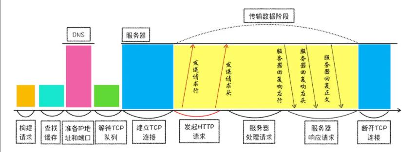
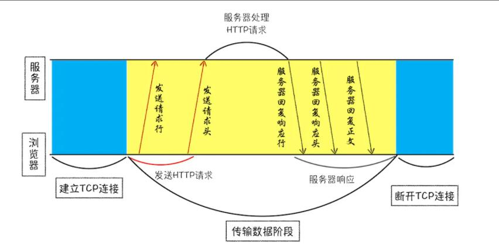

> HTTP协议是建立在TCP连接基础之上的，它是一种允许浏览器向服务器发送请求获取资源的协议，是Web的基础。通常都是由浏览器发起请求，来获取服务端的资源如HTML文件、CSS和js文件，除此之外还可以获取图片和视频等资源，而作为前端开发，了解和浏览器打交道最广的HTTP协议的请求流程，是十分重要的。

## 一、 浏览器发起HTTP请求的流程
### 1. 构建请求行
首先浏览器会基于请求构建请求行信息，请求行由三部分组成：
请求方法 请求的文件路径 HTTP协议版本
```js
GET index.html HTTP1.1
```

### 2. 查找浏览器缓存
在真正发起HTTP请求之前，浏览器会先在浏览器本地的缓存中查找是否有本次请求所需要的资源。
+ 如果发现在浏览器缓存中存有本次请求的资源副本，那么会拦截本次请求直接将缓存中文件返回，并直接结束本次HTTP请求，不会再去服务器重新请求。

+ 如果没有在浏览器的缓存中查找到资源，那么才会进入网络请求的过程。

### 3. 准备IP地址和端口号(在建立TCP连接之前)
由于浏览器这款软件是将HTTP协议当作应用层的协议，用于封装请求的文本信息；并且使用TCP/IP协议当作传输层协议，所以在发起HTTP请求之前必须先通服务器建立TCP连接，TCP协议是一种面向连接的、可靠的、基于字节流的传输协议，也就是说HTTP构建的请求行、请求头这些数据必须通过TCP建立连接之后，在TCP的传输数据阶段来实现传输的。


HTTP协议和TCP协议的关系大致是：

TCP建立连接阶段
浏览器通服务器建立TCP连接，三次握手

TCP传输数据阶段
浏览器发送HTTP请求，包括发送请求头、请求行以及请求体
服务器接受到请求后开始处理HTTP请求...
服务端响应HTTP请求，包括返回响应行、响应头以及响应体

TCP断开连接阶段
浏览器同服务器断开TCP连接，四次挥手

问：HTTP请求的第一步是什么？
是准备同服务端建立TCP连接

问：建立TCP连接的第一步是什么？
准备目标端的IP地址和端口号，构建一个TCP头信息附加到数据包的头部。

问：IP地址和端口号从哪里获取？

HTTP在发送请求前建立TCP连接时所需的IP地址和端口号从请求的URL中获取。
一个合法的URL(统一资源定位符)中包含了请求的协议、域名、端口号、资源路径、哈希、查询参数等多个值。
+ 获取到域名，基于DNS(Domain Name System 域名系统)服务器查询到域名对应的主机IP地址。DNS查询的过程中也会涉及到DNS预解析、浏览器提供的DNS域名缓存服务等操作，也是为了更快的确定服务端的IP地址。

+ 至于端口号，一般情况下如何URL中没有指定端口号，那么HTTP协议默认是80端口，HTTPS协议默认为443端口。

### 4. 等待TCP队列（在建立TCP连接之前）
如果是HTTP1.1版本的请求，在建立TCP连接之前还需要确认当前请求是否需要在建立TCP连接前排队等候。
在Chrome中有一个机制，那就是同一个域名最多只能建立6个TCP连接，如果某一时刻同一域名下有10个请求发生，那么其余的4个会进入到TCP队列中进行排队等候，直到这个域名下进行中的域名请求完成之后，才可以进入TCP连接。

### 5. 建立TCP连接 
此过程就是客户端与服务端进行三次握手，也就是总共发送3个数据包确认连接的阶段（后续会专门详解三次握手的过程）

### 6. 发送HTTP请求
一旦建立TCP连接成功之后，就进入了数据传输阶段。此时浏览器就可以和服务器进行通信了，而HTTP中的数据就是在这个通信过程中进行传输的。

浏览器会首先将构建好的请求行信息发送给服务器，请求行的作用就是告诉服务器客户端所需要的资源是什么，请求行包含了请求的方法、请求的URI和HTTP版本协议

最常见的请求方法是GET和POST，GET请求一般不需要请求体，而是直接通过在请求URL中拼接查询参数来告诉服务器。

POST请求一般用于客户端提交一些信息如表单给服务器,一般POST请求还需要将收集的数据基于请求体发送给服务器。

在发送请求行之后浏览器会以请求头的形式发送其他一些信息给服务器，请求头的主要作用是浏览器的一些基础信息告诉服务器，比如：
+ Host：当前请求的主机域名信息
+ Connection：keep-alive 告诉服务器保持长连接，避免重复三次握手建立tcp连接
+ Accept-Language：浏览器可以读取的语言
+ Accept-Encodeing：浏览器可以支持的压缩方式
+ Accept:浏览器支持的资源文件类型，如text/html
+ Cookie:浏览器端的Cookie信息
+ Cache-Control:浏览器端的缓存策略是强缓存
+ User-Agent:浏览器内核和操作系统等信息


## 二、 服务器响应HTTP请求的流程
服务器在接受到客户端请求之后，就会基于请求行和请求头中的信息来准备返回的资源文件。
基于curl -i命令可以查看服务器返回响应的全部数据
curl -i 会获取响应头和响应行以及响应体的全部数据
curl -I 只会获取响应头和响应行，不会获取响应体数据
```
curl -i https://wht.im/
```

### 1. 返回请求
服务器会首先返回响应行信息给客户端
```js
HTTP/1.1 200 OK
```
响应行信息由三部分组成：HTTP协议版本 响应状态码 对于状态码的描述(关于响应状态码的分类会专门介绍)，总之服务器会基于状态码来告诉浏览器本次请求的处理结果。

随后服务器会返回响应头信息给客户端
服务器返回的响应头信息中包含了服务器自身的一些信息:
```js
Server: marco/2.14  服务器信息
Date: Sun, 28 Nov 2021 14:20:22 GMT 服务器生成返回数据的时间
Content-Type: text/html 返回的数据类型
Content-Length: 4340 返回的数据字节长度
Connection: keep-alive 保持TCP长连接
Vary: Accept-Encoding 
ETag: "484903b00f89708a70e3f085389563a8" 
Last-Modified: Thu, 22 Apr 2021 04:06:04 GMT
Expires: Sun, 28 Nov 2021 14:23:22 GMT
Cache-Control: public, must-revalidate, max-age=180
Accept-Ranges: bytes
```
最后服务器会返回响应体数据给客户端，响应体中就包含了本次请求所需要的资源文件，浏览器会先从网络进程去下载这个资源，然后将资源提交给渲染进程进行渲染。

### 2. 断开连接
一般情况下：如果服务器向客户端返回的资源，那么本次请求就到此结束，TCP连接就要关闭。
但是如果浏览器或者服务器的任意一方在其头信息中加入了：Connection:keep-alive的话就代表TCP连接需要继续保持连接状态不要关闭，此时浏览器就可以复用这个TCP连接来传输数据，从而免去重新建立TCP连接所需的时间,从而提高资源加载的速度提升性能。


### 3. 重定向操作
一般情况下，一次完整的HTTP请求就到此结束了；但是如果服务器返回的状态码是301或者302的话，还涉及一个重定向操作。

如果服务端返回的状态码是301 Moved Permanently，也就是永久重定向，此时浏览器需要重定向到另外一个网址，网址信息就保存在响应头的location字段中，并用该地址重新进行导航。


## 问题汇总
### 问题一：为什么有些站点第一次打开很慢，当再次访问这个站点的时候速度很快？

这是因为在第一次请求的过程中，浏览器将请求的资源数据缓存在了本地。当第二次请求的时候，很多资源都不需要重新发起请求去获取而是直接从本地缓存的资源副本加载，这中间省去了进行网络请求所消耗的时间；除此之外，还有一个重要因素就是浏览器也会讲DNS查询记录缓存在本地，也减少了DNS解析所消耗的时间。

> 服务器是通过什么方式让浏览器缓存数据的？
第一次请求的时候，服务器会在HTTP的响应头中通过Cache-Control字段来设置是否需要缓存该资源。
一般情况下，我们需要为这个资源设置缓存过期的时长，而这个时长就是通过Max-age值参数设置的，注意单位是s，不是ms。
```js
Cache-Control:Max-age=1024;
```
代表着本次服务器返回的资源需要缓存，并且在浏览器本地缓存的时间是1024秒

+ 如果缓存资源没有过去那么再次请求就会拦截该请求并直接返回缓存中的资源给浏览器
+ 如果缓存过期了，那么浏览器会继续发起新的HTTP请求，并且在请求头中加上:
```js
If-None-Macth:'4f80f-13c-3a1xb12a';
```
服务器收到请求之后，会根据If-None-Macth字段的值来判断本次请求的资源来服务器上是否有更新：
+ 如果没有更新，那么就返回状态码304 Not Modified，告诉浏览器本次请求的资源在服务器没有发生过更新，你可以继续使用之前的缓存资源副本，这次就不再返回新的数据了。

+ 如果已经发生了更新，就将最新的资源返回给客户端。


### 问题二：为什么登录过一个网站之后，下次再访问的时候就不需要重新登录而已经是登录态了？

+ 服务端在接受到浏览器提交的用户登录信息之后，查询后台数据库并验证用户身份是否正确，如果正确的话会生成一段表示用户身份的字符串，并将该字符串参数写入到响应头的Set-Cookie字段中，然后将该信息响应给浏览器。

```js
Set-Cookie:UID=159842301;
```

+ 浏览器接受到响应头并解析，如果响应头中包含了Set-Cookie字段，那么浏览器就会将该字段中的信息保存到本地，cookie是浏览器本地存储的一种方案，有专门的js方法对其进行读写操作。

+ 当第二次用户再次访问该网站的时候，在发起请求之前浏览器会读取之间存储在本地的cookie信息，并把数据写入到本次请求头的Cookie字段中提交给服务器。
```js
Cookie：UID=159842301;
```

+ 服务器在接受到请求之后，解析请求头信息中的Cookie字段之后，获取到UID=159842301的信息之后，服务器查询数据库来判断该用户是否为已登录状态，如果查询正确就直接返回包含该用户信息的数据给浏览器，就不用重新进行登录了。

### 问题三：如果一个页面的网络加载时间过久，你是如何分析卡在哪个阶段的？
最好的方法是基于Network面板下的Timing来来进行分析。
Timing表示该请求的时间线轴线：

1. Quened at 36.01ms 
	代表发送请求前的排队所消耗时间为36.01ms
	有可能是前面有正在发送的请求
	有可能是有的请求优先级比较高所以排队（network中有Priority选项代表请求的优先级）

	Started at 36.01ms
	正式开启请求时间

2. Connection Start 开始连接
	Stalled     tcp链接复用 处理代理相关的逻辑所等待的时间
	DNS Lookup  DNS域名解析消耗的时间
	Initial connection 创建TCP连接所消耗的时间
	SSL 如何是HTTPS请求进行SSL协商消耗的时间

3. Request/Response 请求响应阶段
	Request sent 发送请求的时间 很短 没法优化
	Waiting（TTFB）从发起请求到服务器返回首字节时间（可优化点：请求发出到响应总时长）
	Content Download 服务器返回的资源下载所需时间（可优化点：返回资源的大小会影响时间）
