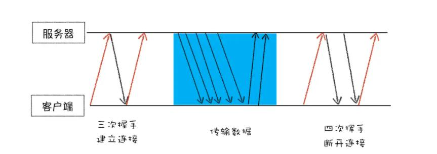
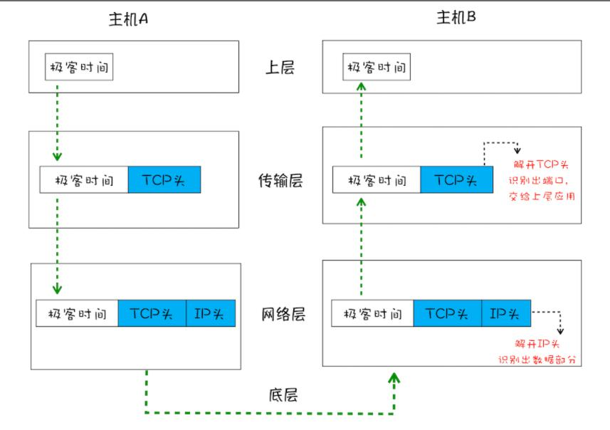

> 互联网其实就是由一套理念和协议组成的体系架构，而协议的含义就是一套多方都认可和遵守的规则和标准，那么只要互联网上大家都遵守这一套约定俗成的协议，它们之间的通信才会变得毫无障碍。
## 一、IP协议：将数据包送达主机
> 在网络中，一个文件通常会被拆分为很多数据包来进行传输，而数据包在传输过程中又有很大概率丢失或者出错。那么如何保证页面文件能被完整地送达浏览器呢？

IP协议：Interneet Protocal网际协议标准，是网络层的协议。

数据包要在互联网上进行传输，就必须符合IP协议规定的标准，互联网上的任意一台设备都有一个IP地址，这个IP地址就是计算机的地址，由数字组成。浏览器访问任何网站其实都是当前计算机向另外一台计算机请求信息的过程。

<!-- 将数据包从主机A发送到主机B，在网络层做了什么？
1. 主机A的应用层将数据包交给网络层
2. 网络层在此会在数据包的头部附加一个IP头的数据结构里，这个IP头包含了以下信息：
    + 当前主机A的IP地址（便于主机B回复信息）
	+ 目标主机B的IP地址（便于寻址）
	+ IP协议版本
	+ 生存时间等信息
	主机A在原有的数据包基础上添加了IP头之后，组成新的IP数据包，交给底层的物理层传输
3. 底层通过物理网络将数据包传输给主机B
4. 数据包被传输到主机B的网络层，在此主机B会拆开数据包的IP头信息，并将拆开之后的数据包交给应用层
5. 至此，数据包就从主机A被送达至主机B了 -->

## 二、UDP协议：将数据包送达应用程序
> 基于IP协议，此时数据包已经从主机A传输到主机B了。但是要注意，IP协议是非常底层的协议，它只负责把数据包从主机A传输到主机B，但是传输过去以后主机B并不知道该如何将数据包交给哪一个应用程序去使用，是腾讯视频还是QQ音乐？所以需要基于IP协议之上开发能和应用程序打交道的协议，这其中最常见的有两种，一种是UDP协议，一种是TCP协议。

UDP协议：User Datagram Protocol 用户数据包协议 是传输层协议

UDP协议中最主要的一个信息是端口号信息，端口号其实就是一个数字（取值范围：0~65535）。每一个计算上想访问网络的程序都需要绑定一个端口号，基于端口号UDP协议就可以将数据包发送给指定的应用程序了，也就是基于IP地址把数据包发送给指定的计算机，基于端口号把数据包发给指定的应用程序。

将数据包从主机A发送到主机B，在传输层做了什么？
<!-- 1. 主机A在上层将数据包交给传输层
2. 传输层在此会在数据包的头部附加一个UDP头的数据结构，这个UDP头中包含了对应应用程序的端口号信息，最后将附加了UDP头的数据包交给网络层处理
3. 网络层在此会在数据包的头部附加一个IP头的数据结构里，这个IP头包含了以下信息：
    + 当前主机A的IP地址（便于主机B回复信息）
	+ 目标主机B的IP地址（便于寻址）
	+ IP协议版本
	+ 生存时间等信息
	主机A在原有的数据包基础上添加了IP头之后，组成新的IP数据包，交给底层的物理层传输
4. 底层通过物理网络将数据包传输给主机B的网络层，在此主机B会拆开数据包的IP头信息，并将拆开之后的数据包交给传输层处理
5. 传输层会在此将UDP头拆开，并根据UDP中提供的端口号信息，把数据部分交给上层的应用程序
6. 最终，数据包就从主机A被送达至主机B的指定的应用程序了 -->

### UDP协议缺点：不能保证所传输的数据的完整性，可能会丢包
1. 对于错误包不重发直接丢弃
基于UDP协议在发送数据的时候，有各种因素都会导致数据包出错，虽然UDP协议会校验数据包是否正确，但是对于错误的数据包UDP并不会提供重发的机制，而是将这个错误的数据包进行丢弃。
2.无法知道这些数据包是否到达目的地
UDP协议在发送数据之后，是无法知道这些数据包是否到达目的地。

### UDP协议的优点：传输速度快
UDP协议基于其传输速度快的特点，多用于一些主要关注速度但是不那么严格要求数据完整性的场景，比如在线视频、游戏直播等。

## 三、TCP协议：把数据包完整的送达应用程序
> 了解 TCP 协议，是为了全方位了解 HTTP，包括其实际功能和局限性，之后才会更加深刻地理解为什么要推出 HTTP/2，以及为什么要推出 QUIC 协议，也就是未来的 HTTP/3。这是一个由浅入深、循序渐进的过程。
### 有了UDP协议为什么还需要TCP协议？
对于浏览器请求、或者邮件这类应用程序，对于数据传输的可靠性和完整性要求高，如果使用UDP协议会存在两个问题：
1. 数据包再传输的过程中一旦出错直接丢失不会进行重发，造成数据传输不完整
2. 大的文件会被拆分成需要小的文件进行传输，这些小的数据包经过不同的路由、并在不同的时间段到达接收端，UDP协议不具备可以按照发送顺序组装这些数据包的能力，从而无法将多个小的数据包还原成为一个大的文件。

基于以上两个问题,TCP协议出现了。

### TCP协议是如何解决UDP传输问题的？
TCP协议：Transmission Control Protocol 传输控制协议 是传输层的协议

TCP协议是面向连接的、可靠的、基于字节流的通信层传输协议，对于UDP传输出现的问题，TCP协议是在这样解决的：
1. 提供重发机制，对于传输过程中丢失的数据包可以重新发送
2. 引入数据包排序机制，保证将乱序的小的多个数据包组合成为一个大的文件

### TCP是如何保证重传机制和数据包的排序功能的？
一个完整的TCP连接的生命周期包括了以下三个阶段：

1. 建立连接阶段
建立连接阶段是通过TCP的三次握手来建立客户端和服务器之间的连接的。
TCP提供面向连接的通信传输，面向连接的意思就是在数据开始正式传输之前，客户端和服务端必须做好两端之间的准备工作,也就是两端必须确认连接之后才会开始传输数据，而如何确认建立连接是基于“三次握手”来进行的。三次握手指的是在建立一个TCP连接的时候，客户端和服务器总共要发送三个数据包以确认连接的建立。

2. 传输数据阶段
此阶段，接收数据端需要对每个数据包进行确认操作，并且在确认接受到数据包之后，需要发送已经确认接受的数据包给发送数据端。

> 超时重发机制
当发送端在发送一个数据包之后，在规定的时间内没有收到接收端反馈的确认信息，那么就判定为该数据包丢失，此时会触发发送端的重发机制，也就是会重新发送一个数据包给接收端。

> 排序机制
一个大的文件在传输的过程中会被拆分成需要小的数据包进行传递，这些数据包再到底接收端之后，接收端会解开数据包的TCP头中的序列号信息，并基于序列号将乱序的数据包组装为完整的文件。

> 差错校验机制
接收端会校验数据是否正确

3. 断开连接阶段
断开连接阶段是通过TCP的四次挥手来断开客户端和服务端之间的连接的。
基于四次挥手来保证传输双方都能正确断开连接。

综上所述：TCP协议相比于UDP协议传输速度肯定会变慢，因为这中间有三次握手建立连接和数据包校验排序重组所消耗的时间，但是正是基于有以上这些特点，TCP协议也保证了传输过程中数据的完整性。

## 四、将数据包从主机A发送到主机B，经历了哪些过程？

1. 主机A在上层将数据包交给传输层

2. 在传输层如果基于UDP协议传输：
传输层在此会在数据包的头部附加一个UDP头的数据结构，这个UDP头中包含了以下信息：
	+ 本机应用程序的端口号信息
	+ 目标应用程序的端口号信息
最后将附加了UDP头的数据包交给网络层处理

3. 在传输层如果基于TCP协议传输：
传输层在此会在数据包的头部附加一个TCP头的数据结构，这个TCP头中包含了以下信息：
	+ 本机应用程序的端口号信息
	+ 目标应用程序的端口号信息
	+ 用于排序的序列号信息，用于接收端通过序号来重排数据包
最后将附加了TCP头的数据包交给网络层处理

4. 网络层在此会在数据包的头部附加一个IP头的数据结构里，这个IP头包含了以下信息：
    + 当前主机A的IP地址（便于主机B回复信息）
	+ 目标主机B的IP地址（便于寻址）
	+ IP协议版本
	+ 生存时间等信息
	主机A在原有的数据包基础上添加了IP头之后，组成新的IP数据包，交给底层的物理层传输
	
5. 底层通过物理网络将数据包传输给主机B的网络层，在此主机B会拆开数据包的IP头信息，并将拆开之后的数据包交给传输层处理

6. 传输层会在此将UDP头/TCP头拆开，并根据UDP头/TCP头中提供的端口号信息和序列号，把数据包交给上层的应用程序

7. 最终，数据包就从主机A被送达至主机B的指定的应用程序了

### 问题1：在传输数据的那个阶段浏览器就开始渲染了？
在客户端接收到服务端的响应头信息中的content-type字段的时候，浏览器就准备渲染进程
在客户端接受到服务端的响应体中数据的时候，浏览器渲染进程中就开始进行Parse HTML构建DOM树了

### 问题2：基于HTTP传输为什么不用担心数据包丢失的问题？
因为HTTP是应用层协议，它是在TCP协议也就是传输层之上的。数据包丢失的重发和排序都是在TCP层就完成的，所以传输层交给应用层的数据包一定是完整的，而且保证数据包是按照顺序传递的。

### 问题3：哪些因素会导致数据包传输的过程中丢失或者出错？
网络波动
物理线路故障
设备故障
恶意程序连接
网络阻塞等