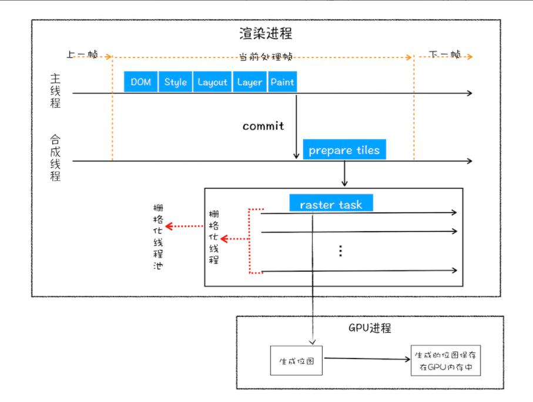
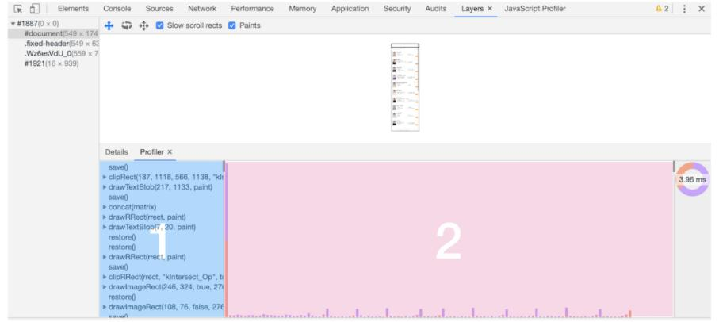

7> 当网络进程将资源提交给渲染进程的时候,此时渲染进程就要开始渲染页面了。浏览器的渲染机制是十分复杂的，所以渲染会被划分为很多子阶段，输入的HTML、CSS、JS以及图片等资源经过这些阶段，最终输出像素展示到页面上，我们把浏览器的这样一个处理流程叫做渲染流水线。


## 渲染流水线
按照渲染的时间顺序，我们把浏览器的渲染时间段分为以下几个子阶段，需要注意的是每一个子阶段的输出都会当做下一个子阶段的输入，这也符合实际的工厂流水线的场景。

1. 构建DOM树
2. 构建CSSOM树
3. 布局阶段
4. 分层
5. 绘制
6. 分块
7. 光栅化
8. 合成

## 构建DOM树
在详细了解浏览器是如何构建DOM树之间，我们先思考下浏览器为什么需要构建DOM树？
这是因为浏览器作为一款软件，它的排版引擎决定了它并不能直接识别HTML文件，而是需要先经过Parse HTML阶段，也就是先将HTML文件中的一个个标签解析为浏览器可以理解一个个DOM树节点，然后才能进行后续的渲染工作。

流程：输入HTML —————— Parse HTML —————— 输出DOM树
如何查看浏览器解析HTML产生的DOM树？
在console控制台输入document回车，就可以看到浏览器解析之后完整的DOM树结构。DOM树结构和HTML几乎是一样的，唯一的区别是浏览器为DOM提供了可供js增删改查的接口。

## 样式计算 Recaculate Style生成CSSOM树也就是styleSheets
上一步已经得到了DOM树结构，但是每一个节点的具体样式还无法确定，所以这一阶段主要的任务就是进行样式计算，计算出每一个dom节点具体的css样式，这个阶段总共分三步进行：

### 1. 将CSS文本转化成浏览器理解的styleSheets

和浏览器解析HTML文件的原因一样，浏览器自身也是不能直接理解CSS文本样式的，所以浏览器渲染引擎在解析CSS文件的时候，会将CSS文本先转化为浏览器可以理解的结构，也就是styleSheets。

如何查看浏览器解析CSS产生的styleSheets?
在console控制台中输入document.styleSheets,便可以看到浏览器解析之后的样式表。和解析HTML产生的树结构不同的时候，浏览器解析CSS文本会得到一个列表(document.styleSheets的值是一个数组列表StyleSheetList)。列表里面每一项都是一个CSSStyleSheet这个类构造出来的对象，这种数组结构同时具备了查询和修改的功能，为后续JS来操作样式打下基础。
```js
StyleSheetList：[
	0:CSSStyleSheet{
		cssRules: CSSRuleList {0: CSSStyleRule, 1: CSSStyleRule}
		disabled: false
		href: null
		media: MediaList {length: 0, mediaText: ''}
		ownerNode: style
		ownerRule: null
		parentStyleSheet: null
		rules: CSSRuleList {0: CSSStyleRule, 1: CSSStyleRule, 2: CSSStyleRule, length: 3}
		title: null
		type: "text/css"
		[[Prototype]]: CSSStyleSheet
	},
	1:CSSStyleSheet{...},
	2:CSSStyleSheet{...}
]
```

### 2. 将样式表中的非标属性值转化为浏览器可以理解的标准属性值
上一步我们已经拿到了将CSS文本转化后对应的StyleSheets结构了，接下来就要对其进行属性值的标准化操作。
具体来说就是我们日常写的css样式中有一些属性值其实是不标准的，这些属性值难以被渲染引擎所直接理解，比如：
```css
div{
	display:none;
	color:red;
	font-size:2rem;
	font-weight:bold;
}
```
像red这种颜色值、bold、rem这种单位都不是渲染引擎容易理解的标准化的计算值，在样式计算之前会有一个将其标准化的过程：
```css
div{
	display:none;
	color:rgb(0,0,255);
	font-size:32px;
	font-weight:700;
}
```

### 3. 计算出DOM树中每个节点的具体样式并保存在ComputedStyle属性中
经过前面两步，此时样式的属性都是标准化的值，此时就可以开始进行样式计算，为每一个DOM节点计算出其具体的样式了。样式计算的核心是遵循CSS的两大核心规则：层叠和继承。

CSS继承规则：子元素会继承父元素的某些CSS属性，如果父元素也没有声明，那么会继承自浏览器的默认样式user agent stylesheet。在样式计算的过程中，浏览器会基于DOM节点的继承关系来合理计算样式

CSS层叠规则：对于一个DOM节点来说，如果该节点有来自多个源的属性值，那么如何确定哪些属性值会被最终应用到节点身上生效，这其中的算法就是CSS的层叠规则。

样式计算阶段会计算出每一个DOM节点的具体样式，在计算的过程中会遵守CSS的层叠和继承两个规则，并把最终每个DOM节点的样式保存在该节点的ComputedStyle中。在chrome浏览器中任意选中一个标签，然后点击右侧的ComputedStyle，就可以获取到该节点计算后的全部样式。

> 关于如何用JS获取某个DOM节点的全部计算样式
```js

function getEleStyle(ele:HTMLElement,attr:string){
		/* IE浏览器 */
	if(ele.currentStyle){
		return ele.currentStyle[attr];
	}else{
		/* Chrome浏览器 */
		return window.getComputedStyle(ele,null)[attr];
	}
}

eg:
const app = document.querySelector('#app');
const appStyle = getEleStyle(app,'color');
```

## 布局阶段：形成布局树Layout Tree 
现在有了DOM树和每个DOM节点的样式信息，还需要知道每一个DOM元素在页面的几何位置信息，那么接下来需要计算出每一个DOM树中可见元素的几何位置，我们把这个阶段称之为布局阶段。

### 1. 创建布局树Layout Tree，过滤掉所有非可见节点
为了构建最终的布局树，浏览器会遍历DOM树上的所有可见节点，并将这些节点依次添加到布局树当中。需要注意的是：

+ 一开始生成的DOM树中有一些节点最终并不会被渲染展示，比如head标签下的所有内容都不会被渲染；
+ 其次在进行CSS样式计算的时候,会有一些节点的display为none,所以这些节点也不会被添加进最终的布局树中。

### 2. 布局计算
接下来就开始计算布局树中每一个节点具体的几何位置坐标信息了，在布局的过程中浏览器会将布局计算的结果又写回到布局树中，此时布局树中就保存了每一个节点的几何坐标信息

## 分层阶段：对布局树进行分层，形成分层树
在渲染进程真正渲染页面之前，还需要对页面上一些复杂的效果进行处理，比如3D旋转，页面滚动或者是使用z-index做z轴上的排序，为了方便实现这些效果，渲染引擎还会为一些特殊的节点生成专用的图层，并最终生成一颗图层树，也叫作LayerTree。（(Layer Compositor：生成图层）

在Chrome的开发者工具中，有一个Layers标签就可以查看整个页面的分层情况。可以看到渲染引擎为页面上的不同节点分了不同的层，最终和PS一样这些图层叠加后合成页面。

> 哪些元素会在渲染的时候被单独分为一层？
+ 拥有层叠上下文属性的元素会被提升为单独的一层
开启了定位属性的元素：position:fiexed
定义了透明属性的元素 opacity:0.5
使用了css滤镜的元素：filter:blue(5px)
定位元素声明了z-index属性

+ 当文字超出盒子边界产生裁剪的时候，文字部分会单独提升为一个层
```css
一旦div盒子中文字超出盒子的最大边界而产生滚动的时候，文字就会被单独提升为一个层
div{
	width:50px;
	height:50px;
	overflow:auto;
}
```

## 图层绘制：为每个图层生成待绘制指令列表，并commit给合成线程

在完成图层树的构建之后，渲染引擎会对图层树中的每个图层进行绘制。渲染引擎绘制图层的时候，会把每一个图层的绘制分解为多个小的绘制指令，然后这些绘制指令按照绘制的顺序组成一个待绘制列表,随着时间按照指令依次绘制。

> 查看浏览器绘制图层的流程：
1. 打开Chrome的Layers标签，选中左侧的document
2. Details标签代表等待绘制的指令列表
3. 右侧Profiler页面代表绘制图层的时间轴
4. 然后拖动右侧的时间轴，查看随着时间的进行页面的绘制过程

## 栅格化raster操作：将图层基于视口划分为图块，并将图块栅格化为位图
绘制列表只是用来记录绘制顺序和绘制指令的列表，而实际上绘制操作是由渲染引擎中的合成线程来完成的。当上一步的图层绘制指令列表准备好之后，渲染主线程会把该绘制指令列表提交给合成线程。

> 为什么要用合成线程？避免一次绘制过多页面 而是分块进行绘制
当一个页面内容很多的时候，浏览器不可能一次性将所有内容全部绘制完成，而是只绘制用户视口区域的一部分页面呈现给用户，那么如何实现呢？

合成线程的主要工作就是将大的图层划分为小的图块，一般图块的大小是256或者512px，然后合成线程会按照当前视口附近的图块来优先生成位图，实际生成位图的操作是由GPU显卡进程中的栅格化来加速执行的。

> 什么是栅格化？将图块转化为位图
栅格化就是将图块转化为位图的操作，图块是栅格化执行的最小单元，渲染进程会准备一个专门供栅格化的线程池，所有图块的栅格化都是在线程池中执行的。

通常，栅格化过程都会使用 GPU 来加速生成，使用 GPU 生成位图的过程叫快速栅格化，或者 GPU 栅格化，生成的位图被保存在 GPU 内存中。

## 合成和展示
1. 合成线程发送DrawQuad命令给浏览器主进程
渲染进程的合成线程接收到图层的绘制消息时，会通过光栅化线程池将其提交给GPU进程，在GPU进程中执行光栅化操作，执行完成，再将结果返回给渲染进程的合成线程，执行合成图层操作！
此时合成线程就会生成一个绘制图块的命令——“DrawQuad”，然后将该命令提交给浏览器进程。

2. 浏览器进程接收到DrawQuad命令将页面展示到显示器上
浏览器进程里面有一个叫 viz 的组件，用来接收合成线程发过来的 DrawQuad 命令，然后根据 DrawQuad 命令，浏览器进程里会执行显示合成(Display Compositor)，也就是将所有的图层合成为可以显示的页面图片。 最终显示器显示的就是浏览器进程中合成的页面图片

## 重排、重绘和合成操作对于渲染流水线的影响


### 1. 重排reflow：更新了元素的几何属性
如果我们通过javascript和css修改了一个元素的几何位置属性，比如改变元素的宽度和高度，那么这种操作会触发浏览器的重新布局，也就是要重新布局计算每个元素的几何位置，然后进行分层和图层绘制等之后一系列的子阶段，由于这种操作会重新更新完整的渲染流水线，所以对浏览器渲染的开销最大，我们把这种操作叫做重排。

### 2. 重绘repaint：更新了元素的绘制属性
如果我们通过js或者css修改了一个元素的绘制属性，比如颜色、背景颜色等，这种操作只是修改了元素的外观，并没有引起元素几何位置的变化，所以不用进行新的布局和分层阶段，而是直接进入渲染流水线的绘制阶段，所以相对于重排来说这种操作的开销相对要小一点。

### 3. 直接合成：更新一个既不是几何又不是绘制的属性
如果我们用新增的css3属性比如transform属性来实现了一个动画效果，那么这种操作既不会修改元素的几何属性也不会修改元素的绘制属性，这时候渲染进程会在非主线程上开直接执行合成动画操作，这中间直接跳过了布局和绘制阶段，也不会占用渲染主线程的资源，所以这种操作是最节省性能的。
这也就告诉我们在为一个元素实现样式变化的时候，尽可能的用css3的transform属性来执行变化，因为这样不会触发重排和重绘，执行效率最高。
